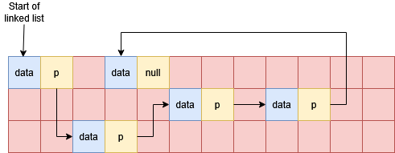
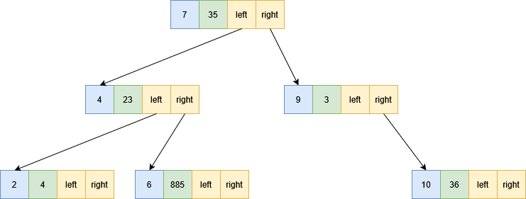
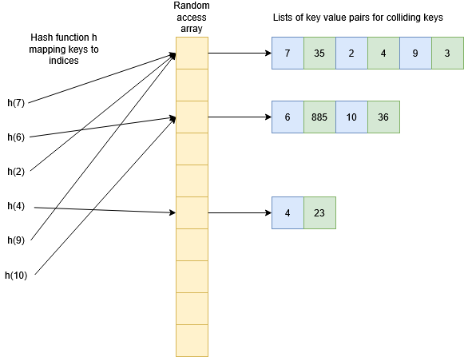

# Common Data-Structures

There are some key data-structures with which you will need to be familiar. Each of these is a kind of container; we shall consider how these structures affect how we can access and insert data. We will discuss the complexity of data access and insertion for some of these in class.

## Random Access Arrays

A _random access array_ is the kind of array with which you are already familiar. Data is laid out sequentially and contiguously in memory, and so it is easy to calculate the memory location of any given element from the starting memory location and the index $i$ of the element. This is why they are called _random access_: we can access any element of the array in $O(1)$ time and no elements are harder to find than any others. Inserting an element into a random access array is often cumbersome due to the need to keep the data contiguous: if you want to insert data somewhere other than the end of the array then you need to shift all elements that appear afterwards in memory. This operation is $O(n)$. 

`std::vector`, `std::array`, and C-style arrays are all examples of random access arrays. 

### In detail: `std::vector` in C++

The most common form of random access array that we use in C++ is `std::vector`, so it's worth understanding a bit more about how it works. `std::vector` comes with operations to insert and remove elements, and it distinguishes between insert/removal in the middle of the vector and at the end. 

#### Time complexity of `push_back` and `pop_back`

To add an element at the end of an array we can use `push_back`. To understand this operation's behaviour from a complexity point of view, we have to think about the way that `vector` allocates and manages memory. A `vector` will allocate memory on the heap for its elements, and it will often allocate more memory on the heap than it needs to store its elements. It has separate data members to keep track of the size of the vector (i.e. the number of elements), and the size of the allocation. If the allocation is larger than the current size of the vector, then `push_back(x)` can simply place `x` in the next address in memery and increment the size counter. If however the allocation is full, a new, larger, allocation will need to be made and the entire array of data copied over to the new allocation in order to have space to add another element. (The previous allocation is then freed.) This means that some `push_back` operations take much longer than others, and as the vector gets bigger the time for this copy keeps getting larger! Just how much bigger the allocation should be made each time can have a significant impact on how the structure performs: `std::vector` uses a strategy that guarantees that the _average_ (amortised) time for a `push_back` operation remains $O(1)$. (This is because although the time for a reallocating `push_back` keeps increasing as the array gets larger, the frequency of these operations goes down. For example, if you double the size of the allocation each time you reallocate, `push_back` will have amortised constant time.) 

Although `push_back` takes amortised constant time, some `push_back` operations will take longer than others, which may be a concern if you have latency restrictions. Because of the reallocations and the need to check the size of the existing allocation, repeated `push_back` operations carry some overhead compared to simply setting the values within a `vector`. As such, **when the size of the `vector` needed is known ahead of time, it is better to initialise a `vector` of the correct size and then set the elements in a loop rather than using `push_back`** inside a loop. Using `push_back` can be the most natural approach however when this is not possible, for example streaming data in from a file where the total number of elements is not known. 

There is a corresponded operation for removing an element from the end of the list, `pop_back`, which is always constant time since it cannot trigger a reallocation. 

#### Insertion and removal of arbitrary elements

We also have `insert` and `erase` for inserting and removing elements. Removing elements will not require any reallocations, but it does require shifting any data to the right of the elements being deleted. Removing an element is therefore, on average, $O(n)$. Inserting an element works similarly, as it needs to shift any data to the right of the location being inserted into; an additional factor is that like `push_back` it may trigger a reallocation. Insertion is on average $O(n)$. 

## Linked Lists

A _linked list_ is a representation of a list that is stored like a graph: each element of the list consists of its data and a pointer to the next element of the list. A linked list has no guarantees of being stored contiguously, so the only way to navigate the linked list is to follow the pointers from one node to the next; this is in contrast to random access arrays. A common extension of the linked list is the doubly-linked list, which has pointers to the next _and_ previous element in a list. 

The diagram shows a possible layout linked list nodes in memory. The red grid shows memory locations, blue cells are occupied by a linked list data element and the yellow cells are occupied by a linked list pointer; arrows show the location that each pointer stores. Note the list can be terminated with a null pointer.

Accessing element $i$ of the list requires us to read and follow $i$ pointers, and the amount of work done to find elements increases linearly as the we get further into the list. The advantage of a linked list however is that we can add or remove elements more straightforwardly by simply modifying the relevant pointers. This is much simpler than removing or inserting elements in the middle of a random access array, which requires copying memory to keep all the elements correctly in order. 

Linked lists also provide natural representations for various scenarios:

- Singly linked lists can have multiple lists share the same tail.
- Infinite cycles can be easily represented as linked lists without additional book-keeping. 
- Linked lists are _recursive data structures_, which make some algorithms natural to express as simple recursive functions. 

`std::list` is usually implemented as a doubly-linked list, and `std::forward_list` is usually implemented as a singly-linked list. 

## Binary Search Trees

A _binary search tree_ (BST) is another graph based structure, where each node consists of its data, and pointers to a left and right sub-tree (the "left child" and "right child"). The data stored in a BST must admit a comparison operator $<$, so that for a given node with data $d$:

- for all data $d_L$ in the left sub-tree, $d_L < d$, and
- for all data $d_R$ in the right sub-tree, $d_R >= d$. 

A BST is therefore always _sorted_ w.r.t. keys. It is often used to implement _associative arrays_, which is a set of key-value pairs that allow look-up of values based on key. You may be familiar with this concept as a _dictionary_ in Python. If the data in a BST is a key-value pair $(k,v)$, then the ordering is just on the key $k$. Looking up a value based on a key requires traversing the tree from its root and comparing the keys to determine whether to look up the left or right sub-tree at each node. 

The diagram below shows a BST; the first piece of data (in the blue cell) is the _key_, followed by value, the left child pointer, and the right child pointer. A null pointer can be used to represent a lack of left or right child. Note that the tree is sorted by the _key_ and is not sorted on _values_. 

Like a linked list, a BST is not necessarily contiguous, and different nodes may be located anywhere in memory. In order to explore a BST for look-up or insertion we have to follow a chain of pointers to find the memory locations of the nodes.

`std::map` is usually implemented as a BST. 

## Hash Tables 

A _hash table_ is an alternative implementation for an associative array. It consists of a "table" in the form of a random access array. In order to find at which index $i$ of the table a key-value pair $(k,v)$ is stored, we have function $i = h(k)$. An ideal hash function is constant time on all keys and minimises the chance of collisions. A _collision_ between two keys $k_1$ and $k_2$ is when $h(k_1) = h(k_2)$. Note that it is not possible for $h$ to be completely collisionless unless you have at least as many rows in your hash table as elements you want to insert. Generally the table stores some kind of list at each index in order to resolve collisions, so in practice you will typically have a random access array of _pointers_, and each pointer will point to an array (or list, or similar structure) containing all the key-value pairs which hash to that index. 

The diagram below gives an example of a hash table for the same data as the BST above. In the ideal case all the keys would map to different indices in the table, but for illustration purposes we have shown a number of collisions. From each hash function on the left we get an index in the random access array, and then we can follow a pointer to all the data stored at that index.

How quick it is to look up an element in this list will depend on the kind of structure used (for example, all of the above structures could be used!) but the key to a hash table's performance is that **collisions should be rare** so that the size of these lists remains small. If the number of colliding keys is bounded by a constant then the look-up/insertion in the list will constant time, and since the hash function and checking the random access array are also constant time, hash tables have $O(1)$ operations for insertion, look-up, and removal. Just because the complexity is $O(1)$ (under appropriate circumstances) doesn't necessarily mean that hash tables are faster than other methods though: there are overheads to think about as well, especially from the hash function! Often a BST will be faster for moderately sized data. Hash tables can also require allocating more memory than you need.

`std::unordered_map` is usually implemented as a hash table. 