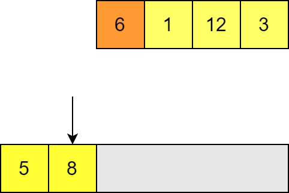

Estimated Reading Time: 45 minutes

# Computational Complexity

Computational complexity is a major field in computer science, and we will only very briefly touch on the subject here. It is foundational in understanding computation as an idea, and underpins many areas of modern computing such as the theory of cryptography. For our purposes it will be enough to get a flavour of how we can study algorithms for their complexity properties, but you may wish to consult the reference texts for this week (or many other standard computer science texts) if you are interested in understanding complexity in a deeper and more rigorous way. 

**Complexity tells us how the time and space useage of solutions to a problem changes with respect to the size of its input.** 

Most commonly in numerical computing scenarios we are concerned with the time complexity of an algorithm, although there are occasions when you may have to worry about space complexity as well. 

## "Big O" Notation

"Big O" notation is a common way to express how the output of a function scales with its input. The formal definition is as follows:

$f(n) \in O(g(n)) \iff \exists m, \alpha . \forall n > m . \mid f(n) \mid \le \alpha g(n)$.

Let's break down what this means:

- A function $f(n)$ is $O(g(n))$ if and only if there exists some values $m$ and $\alpha$ such that whenever $n$ is larger than $m$ then $\mid f(n) \mid$ (the absolute value of $f(n)$ is less than or equal to $\alpha g(n)$. 
    - **A function $f(n)$ is $O(g(n))$ if, as $n$ tends to infinity, $f(n)$ is bounded by $g(n)$ with an arbitrary multiplicative constant.**
- We only require that the comparison holds for all inputs larger than some arbitrarily large value $m$, which means we are looking at _asymptotic behaviour_. We say that $g(n)$ is an **asymptotic upper bound** on $f(n)$. 
    - Practically speaking this means we are generally only interested in _leading terms_. For a quadratic $an^2 + bn + c$, the linear and constant terms will always be overwhelmed by the quadratic term in the asymptotic case, and so are irrelevant. All quadratics are $O(n^2)$, regardless of the values of $a$, $b$, and $c$ (as long as $a \ne 0$).
    - For example: $\mid an^2 + bn + c \mid \le (a+1)n^2$ will always hold for $n$ large enough so that $n^2 > \mid bn + c \mid$, which we know must exist for any coefficients $b$ and $c$. 
- We are allowing an arbitrary constant factor $\alpha$, so constant factors are irrelevant. $n^2$ and $50n^2$ are both $O(n^2)$. We are only interested in the **way that the output scales**, not the actual size. This will be a very important point to remember when applying algorithms in practice!
- For this definition to make sense and be useful, the function $g(n)$ must be asymptotically non-negative.

We can also write $f(n) \in \Omega(g(n))$ if $g(n)$ is an **asymptotic lower bound** of $f(n)$. This is a reciprocal relationship with $O(n)$ i.e. 

$f(n) \in O(g(n)) \iff g(n) \in \Omega(f(n))$. 

There is also a stronger condition:

$f(n) \in \Theta(g(n)) \iff f(n) \in O(g(n)) \wedge g(n) \in O(f(n))$

- This means that $g(n)$ is an **asymptotically tight bound** on $f(n)$, because as $n$ tends to infinity $f(n)$ is bounded by a constant multiple of $g(n)$, and $g(n)$ is bounded by a constant multiple of $f(n)$. 
- Put another way, there are two constants $\alpha$ and $\beta$ for which, as $n$ tends to infinity, $f(n) \ge \alpha g(n)$ and $f(n) \le \beta g(n)$. As such, $f(n)$ is bounded from above and below by multiples of $g(n)$. 
- $f(n) \in \Theta(g(n)) \iff f(n) \in O(g(n)) \wedge f(n) \in \Omega(g(n))$. 

This relationship is symmetric:

$f(n) \in \Theta(g(n)) \iff g(n) \in \Theta(f(n))$.

Asymptotically tight bounds are particularly useful for understanding the behaviour as a function scales. 
Take our quadratic example from before: $an^2 + bn + c \in O(n^2)$ is clearly true, but looking at the definition of $O(g(n))$ we can also say that $an^2 + bn + c \in O(n^3)$, since $n^3$ is asymptotically larger than any quadratic function and therefore acts as an upper bound. The same would be true of many functions which grow faster than quadratics! Likewise $O(n^2)$ includes anything that grows slower than a quadratic, such as a linear function. To say that our quadratic is $\Theta(n^2)$ is much stricter, as it says that our function grows as fast as $n^2$ and no faster than $n^2$ (up to multiplicative constants). 

## Why use Big-O Notation for Algorithms and Computational Problems?

For algorithmic analysis, the functions that we are interested in are the time and space useage of an algorithm as a function if its input size. 

- Time useage is usually understood in terms of the number of "steps" that an algorithm needs to reach a result. How exactly that translates into time in the real world depends on how long each kind of operation takes to do (e.g. memory read, comparison, additions etc.), but these are multiplicative factors. 
    - Note that sometimes things which might appear to be a simple step are more complex. For example, if performing additions with arbitrary precision integers then the time it takes to perform the addition will vary with the size of the number! If using fixed precision then this is not an issue because you know that e.g. a standard `int` is 4 bytes, and so even if the addition is optimised in some way to add smaller numbers quicker they are still bounded by the time it would take to operate on 4 bytes. 
- Space is usually a bit easier to understand as we can reason more directly about the amount of information that we have to store. 
    - When analysing space complexity we do not include the input itself, just any memory that must be allocated for working on. 
- What we mean by the "input size" sometimes needs additional clarification. Traditionally it can be defined in terms of tape size on a Turing machine or bits on a computer, but in practice people may use reason with other things that correspond to this in some way. For example, we may use:
    - The size of a number for a function which takes a single number as input, for example when looking at factoring a prime number. 
    - The number of elements of a list, for example when summing or sorting a list. 
    - The size of a matrix: this example is a little unusual. Sometimes, particularly for a square ($N \times N$) matrix, this is expressed just by $N$, even though the number of elements in the matrix (and therefore the physical input size) is actually $N^2$. On algorithms designed to work on non-square $N \times M$ matrices, you may have complexity in terms of _both_ $N$ and $M$.
        - Adding two square matrices of the same size together is usually described as $O(N^2)$ with $N$ referring just one dimension of the matrix, whereas adding two lists of the same size is usually described as $O(n)$ with $n$ referring to the total number of elements, even though in both cases there is one operation per element of data. This difference is purely because of the way the input size is labelled in these two cases, so watch out for what people mean by $n$ when they tell you something is $O(g(n))$! 
        - The general matrix case for addition would usually be written $O(NM)$. 

Big-O notation (or $\Theta$ and $\Omega$) captures the way that these algorithms work without knowing too much detail about how it is physically performed on a computer: things like the exact amount of time for particular operations, the differences in how memory is divided up for reading and writing, and so on get absorbed into multiplicative factors or additive overheads. Big-O notation captures something more fundamental about the way that problems scale. Even things like modern CPUs doing multiple arithmetic operations in parallel don't affect the computational complexity of an algorithm, since there are still a fixed number of operations than can happen concurrently and therefore this can't contribute more than a constant factor. 

Take for example a trivial summation example: 

```cpp=
double SumVector(const vector<double> &v)
{
    double sum = 0;
    for(auto &x : v)
    {
        sum += x;
    }
    return sum;
}
```

- We're interested here in how we scale with the number of elements in the list, so we'll call this $n$. 
- There is one addition operation for each element in the list, so $n$ operations total. Time complexity is $\Theta(n)$ i.e. _linear_. 
- Regardless of the size of the list, we only allocate one `double` (`sum`) for this function, so the space complexity is $\Theta(1)$ i.e. _constant_. 

For **algorithmic analysis** we can often determine asymptotically tight bounds because we know exactly how an algorithm will behave. As well as analysing the performance of a specific algorithm, one can look at the inherent complexity of a problem itself: with what asymptotic behaviour is it _possible_ to solve a problem? The **complexity of problems** themselves usually uses asymptotic upper bounds (big O) to class them, because one can't generally prove that there exists no better way to do it than the solutions already known. Hence the best solution we have provides an upper bound on the complexity of the problem itself. Getting more precise knowledge of the inherent complexity of many problems is an active area of research.

## The Complexity of Matrix Multiplication

 Let's take as an example the problem of matrix multiplication, an extremely common operation in scientific computing. What is the complexity of matrix multiplication? What algorithms are available to us and how to they get used in practice?

### The Na&iuml;ve Algorithm 

We can define the elements of a product of two matrices as

$C_{ij} = A_{ik} B_{kj}$.

(We have used the [summation convention](https://mathworld.wolfram.com/EinsteinSummation.html).)

The simplest way to implement this is to iterate over $i$ and $j$, and for each element in the product matrix you perform a dot product between the $i$ row of $A$ and $j$ column of $B$ (which iterates over $k$).

- Assuming our matrices are $N \times N$:
    - There are $N^2$ elements to do this for in the product matrix.
    - Calculating each element requires $N$ multiplications.
    - Total number of multiplications is therefore $N^3$.
        - We can see this immediately because we have nested iterations over $i$, $j$, and $k$, each of which has $N$ values.  
    - Nothing else (e.g. memory read/writes) exceeds $N^3$ behaviour either. ($N^2$ writes, up to $N^3$ reads.) 

So from a simple solution we can see that matrix multiplication is $O(n^3)$. It can't be _worse_ than asymptotically $n^3$, but it could be _better_, since we haven't shown that it is bounded from below by $n^3$. 

We _can_ say that matrix multiplication must be $\Omega(n^2)$ i.e. bounded from below by $n^2$, since it needs to fill out $n^2$ values in the output matrix! 

### (Asymptotically) Better Matrix Multiplication 

The most common improved matrix multiplication algorithm is the _Strassen algorithm_. We won't go into the details of how the linear algebra works here, but we simply note:

- The Strassen algorithm divides each matrix into four (roughly equal) sub-matrices.
- Normally a matrix multiplication could be calculated using these sub-matrices by calculating 8 small matrix products. This wouldn't save time: the na&iuml;ve method is $O(n^3)$ and each matrix has size $\sim \frac{n}{2}$, so each sub-matrix multiplication is 8 times as fast, but there are also 8 matrix multiplications to do! 
- By combining some of these sub-matrices through additions and substractions (which are $O(n^2)$) we can actually express the output matrix with just 7 small matrix products! (Again, some addition and subtraction required to build the output matrix after the products are calculated.) 
- The additions and subtractions are negligible because there are a fixed number and they are $O(n^2)$ and therefore sub-dominant. 
- Doing this recursively for submatrices as well leads to an algorithm which is $\sim O(n^{2.8...})$.
    - Extra: To prove this you can the number of operations as a recurrence relation $T(n) = 7T(\frac{n}{2}) + O(n^2)$ and apply the [Master Theorem](https://en.wikipedia.org/wiki/Master_theorem_(analysis_of_algorithms)). Again the recommended texts for this week are a good place to start! 

This may seem like a small gain, but it becomes increasingly important as matrices get large, and large matrix multiplication can be a bottleneck for many numerical codes!

We should bear in mind:

- This algorithm has more overheads than normal matrix multiplication. Asymptotic improvement does not mean it's better for all sizes of problems! For small matrices, the additional overheads of Strassen multiplication make it slower than the straightforward method. As a result, most implementations actually transition to regular matrix multiplication when the sub-matrices get to be small enough in size that this becomes more efficient. This kind of behavioural change is very common when optimising for performance. 
- The Strassen algorithm is less numerically stable than the simple method, although not so much so as to be an issue in typical applications. This is again a common trade off with code optimised for speed, and something to bear in mind if you know that you have to deal with unstable edge cases. 

So is this the best known performance for matrix multiplication? Not quite! The best known algorithm for matrix multiplication is $\sim O(n^{2.37...})$, but this are unusable in practice. It is an example of what is called a _galactic algorithm_; algorithms which have better asymptotic behaviour, but whose overheads are so large that they actually perform worse for any input that could physically fit on any plausible machine. It is a good reminder that asymptotic behaviour isn't everything!

## Algorithm Analysis: Sorting Algorithm Examples

Let's take a look at two sorting algorithms and try to understand something about their complexity. 

### **Insertion Sort**

Insertion sort is one of the easiest sorting methods. We'll sort from smallest to largest. We'll show an _out of place_ implementation because it is easier to visualise, but this can performed _in place_ (i.e. changing the elements of the list as we go instead of putting them in a new list). 

1. It starts with an unsorted list, and in our case an empty buffer to place the elements into. This buffer will store the sorted list at the end and has the property that *it is correctly sorted at every step*. Elements are placed into the output list one by one. Since it starts empty, the first element can go straight in.


2. When placing the next element we compare with each element in the list in turn (starting with the end of the list) to see if it is smaller or larger. If the element is smaller (like here) then we can insert our element.  


3. We then try to insert the next element, again comparing with the last element of the output list. If we find a value that is bigger than the one we want to insert then we need to move along to the next. 



4. Once we've found one smaller we know where to insert the new element. All the elements in the output list to the right will need to be shifted along to make room. 


5. In order to insert this in the right place, we have to move the larger element along one. (This would also mean moving along any elements to the right of this one!) 


6. We can then insert our input element in the space and move on to the next element in the unsorted list. Again we compare until we find a smaller value; in this case we get all the way to the start of the list. Now all of the other elements need to be shifted along in order to insert this element. 


7. We continue until the all elements have been inserted into the output list. Since the output list is always sorted so as soon as we have inserted all the elements we are done. 

What is the time complexity of this? Well, the performance of this algorithm depends on the pattern of the input! There are always $n$ insertions but:

- If the input is already sorted, then every step involves just one comparison. (In the case of an out of place algorithm, an insertion/copy; for an in place sort then this is skipped.) This is therefore linear in the size of the list i.e. $O(n)$. 
- If the output is reverse sorted, then every step involves comparing with every element of the output list and shifting every element as well! The output list grows by one each time so this is proportional to $1 + 2 + 3 + ... = \frac{n^2 + n}{2}$ and therefore $O(n^2)$. 

These are the best case and worse case scenarios. In practice, the average case is still $O(n^2)$, and in general we are usually most concerned with our _worst case_ complexity. Nevertheless, if you have _nearly sorted_ data you can have good performance for an algorithm like this, and it is important to understand how your algorithms are impacted by patterns in the data that you are working on.  

### **Merge Sort**

Merge sort is a "divide and conquer" algorithm: the idea is that we can easily build a sorted list by merging two shorter sorted lists each containing half of the elements.

1. Merging two sorted lists is linear in the size of the list. At each step we comparse the head of the two lists. 


2. Whichever is smaller goes in the output list and then we make the next compare the next pair and insert the smaller and so on. 


3. This is obviously done after $n-1$ comparisons and $n$ insertions so this part is $O(n)$ in the combined size of the lists. 

Naturally a list with only one element is sorted, and so we can turn this into a recursive sorting algorithm using the list with one element as a base case. 

1. The list is recursively divided until you have single elements. Then each of these is merged pair-wise to make sorted lists of size 2. (Merging all the lists involves $O(n)$ operations just as discussed above.)


2. These lists are merged pairwise at each level of recursion until we have the fully sorted list. 


The complexity of this algorithm does not depend on any patterns in the list: a sorted, reverse sorted, or unsorted list still involves the same number of comparisons and merges. 

Each round of merging takes $O(n)$ operations, so we need to know how many rounds there are. We split the list in half at each level of recursion, and we can only do this $\sim log_2(n)$ times before we have lists of size 1, therefore the total complexity is $O(n log(n))$. 

- $O(n log(n))$ is actually optimal asymptotic behaviour for comparison sorting a list!
- $O(n log(n))$ is sometimes called "quasi-linear". 

### *Comparison*

- Merge sort has better asymptotic behaviour than insertion sort in the average and worst case.
- Insertion sort performance can depend strongly on the data.  
- Merge sort has the same best, average, and worst case complexity so is very predictable. 
- Merge sort has higher overheads due to all those recursive function calls. 
- As a result, we know that merge sort will eventually beat insertion sort as long as $n$ becomes large enough, but insertion sort may provide better performance for small lists. 
    - Another popular algorithm is _quicksort_, which has $O(n log(n))$ behaviour in the average case (and is usually faster than merge sort), but $O(n^2)$ behaviour in the worst case. Selecting algorithms the best algorithms is not always obvious! 

## Complexity in Practice

- It's good to be aware of the complexity bounds on problems and algorithms that you will be working with, like matrix multiplication, matrix inversion, data lookups in different kinds of structures etc. 
    - Functions in the standard C++ library will often have known complexity given in the documentation, for example accessing an [ordered map](https://cplusplus.com/reference/map/map/operator[]/) is $O(log(n))$ and accessing an [unordered map](https://cplusplus.com/reference/unordered_map/unordered_map/operator[]/) is $O(1)$ in the average case and $O(n)$ in the worst case.  
- Be aware when you are writing code of how your program scales. Think about things like nested loops and recursions and how their contributions combine. 
- Algorithms with high complexity can become bottlenecks for your programs if their inputs become large. 
- More efficient algorithms can often be a trade-off between time and accuracy or other desirable properties. 
- Algorithms with good asymptotic performance often perform less well on small problems; don't waste time or sacrifice accuracy to use these kinds of methods on small data where they won't benefit!
- Some algorithms have good average case complexity but very bad performance in special cases. Make sure that you're aware of any patterns that you expect in your data and that your chosen algorithm is not impacted by them.
- **Well implemented methods often switch between algorithms depending on the size and nature of the data input to get the best performance.**
    