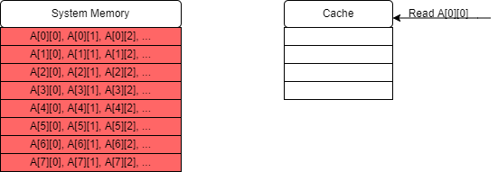
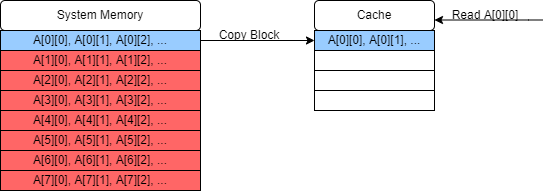
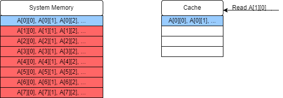
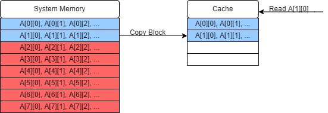
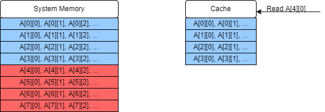
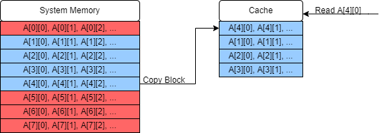
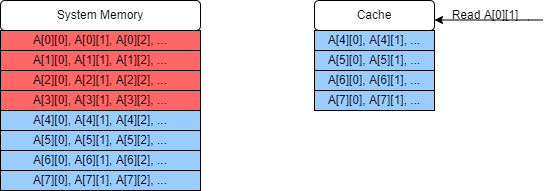
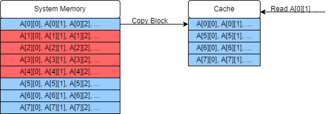
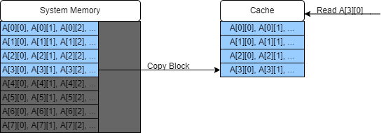
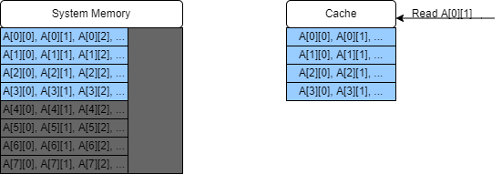

# Memory

Managing memory efficiently can be an important part of achieving peak performance. In this section we'll talk a bit about the basic model of how computers work, how data is stored and accessed, and what this means for software development. 

## Memory Bound Problems

When considering the efficiency of solving a problem on a computer, two classifications can sometimes be useful:

- **Compute bound** problems are those for which the main work or primary bottleneck is the number of compute steps required to complete the algorithm. 
- **Memory bound** problems are those for which our main concern is the time spent accessing (reading or writing) memory. 

A straight-forward example of a memory bound problem would be a matrix transposition, $M^T_{ij} = M_{ji}$. This problem doesn't require any direct calculations to be done on the elements themselves, just to read the elements from one location and place them in another. 

Too keep things simple, let's look at this "out of place" matrix transpose:

```cpp=
vector<vector<float>> Transpose(vector<vector<float>> &M, vector<vector<float>> &MT)
{
    vector
    for(int i = 0; i < N; i++)
    {
        for(int j = 0; j < N; j++)
        {
            MT[i][j] = M[j][i];
        }
    }
    return MT;
}
```

- "Out of place" means that the result is placed in a new matrix rather than over-writing the original. 
- This algorithm is almost entirely composed of memory read/write operations!
- In order to understand how to optimise a memory bound problem like this, we have to first understand the structure of memory in our machine. 

## The Memory Hierarchy

Data is stored in a computer in different forms and different places. Generally, the bigger your memory store, the slower it is to access! This trade-off is typical for developing on many architectures from PCs to specialised accelerated hardware. On a typical computer you're likely to have:

- **Persistant Memory**
    - This is the largest store of data and includes things like your hard disk. Writing to this kind of memory has the highest overheads, but the data remains in tact without power and is typically on the scale of tens of GB or more. 
- **System Memory**
    - This includes on-chip RAM and ROM. 
    - ROM is permanent, and read-only, and generally not of much interest to software developers since it handles things like instructions for basic I/O and loading the operating system: things that we don't (and can't) mess with! 
    - RAM is generally volatile memory, meaning that it requires power to be maintained: if you turn off your computer you will typically lose what is in RAM. Usually on the scale of a few GB. Contains the current program and data in use.
        - Stack: Stack memory is usually $\lesssim 10$ MB, assigned by the operating system when the program is launched. Stack memory cannot be increased while the program is running. Contains data for currently open scopes i.e. the function currently being executed and any hierarchy of functions which are calling it and therefore have not terminated yet. Very large pieces of data or very deep call trees (e.g. excessively deep recursion) can cause a _stack overflow_, where the stack runs out of memory. Stack memory is generally faster than Heap memory. 
        - Heap: The Heap is a larger pool of memory, also assigned by the operating system at the program launch, but the heap size allocated to a program can grow dynamically as long as there is enough space left in RAM. Memory access tends to be slower than for the stack, but can be used for larger datasets.
    - Cache: Very small pieces of memory designed to be very fast. Cache structure is system dependent, but three levels of caching is typical, ranging from kB to MB (with the smallest cache layer being fastest to access). Cache memory stores chunks of data from locations accessed recently in memory. 

This structure has implications for our undertanding of memory bound problems:

- Problems which use very large datasets may be more likely to be memory bound, as larger data stores are less efficient to access. Accesses to large stores should be minimised, and data being worked on should be moved to faster memory. 
- Algorithms which jump around erratically in memory also result in slower memory accesses. Architectures are usually optimised for sequential access to some extent, for example memory addresses close to those recently accessed are more likely to be in the cache.
- Working on a piece of data as fully as possible before accessing another location will limit the number of memory accesses over all. 

## Cache structure 

It's not always possible to limit the number of memory accesses that we make, but we may be able to make choices about our memory access patterns to maximise our useage of our fastest memory. In this case, we'll consider an example where our object is stored entirely in on-chip RAM, but we want to make effective use of the cache. First, we'll need to understand a bit about how the cache works. 

- When data is requested, the cache is checked first to see if it is present. If it is, it can take the data straight from the cache, which is much faster than going into RAM. 
- If there are multiple cache levels, it searches from the smallest (and fastest) cache to the largest (and slowest). 
- If it's not is any cache (a cache "miss") it will fetch the value from RAM. 
- When data is looked up in system memory, that data is stored in the cache. 
    - If the cache is full, then some data in the cache is overwritten. (Which data is overwritten depends on the cache-mapping strategy and will be hardware dependent.)
- Data is added to the cache in blocks of a fixed size (which is hardware dependent). If the variable we wanted to read is smaller than this block size then some neighbouring data will end up in the cache as well. 
    - If we read an element from an array or vector for example, which store data contiguously, that means that some surrounding elements will also end up in the cache. 
    - We can then read close by elements from the cache quickly without system memory accesses until you reach the limits of the copied block!

Taking advantage of these blocks of memory in the cache is the key to writing efficient memory bound algorithms: if we use them wisely we can avoid a lot of calls to system memory and replace them with much quicker calls to the cache. 

### Using the Cache effectively 

We know now that:

- Reading the same memory address (e.g. accessing the same variable), or reading nearby memory addresses (e.g. elements in a vector) is faster than jumping around in memory. 
    - This suggests that we should break problems down into sizes that will fit in the cache, and then work on them until we don't need that data any more before moving on (if we can). 
- The structure and size of the cache, and the size of the blocks loaded into the cache from memory, are all system dependent. 
    - This suggests that over-optimising for the cache is a bad idea: if we design code especially for the specifications of the cache on our machine, it will not be very portable to other machines! We should try to make algorithms that will exploit the cache well but are ideally not dependent on the exact size. 

An algorithm which exploits the cache but which does not depend on the exact details of the cache is called a _cache oblivious algorithm_. Some good patterns for cache oblivious algorithms include:

- Tiling: breaking the problem into small chunks. 
- Stencil algorithms are algorithms which calculate a value at a data point based on the values around it in a grid (e.g. advancing a simulation) and fit naturally into efficient memory structures provided the stencil move sensible through memory. 
- Rearrange data in memory to fit your access patterns. For example a matrix may be stored with elements in the same row next to each other (row major order) _or_ with elements in the same column next to each other (column major order). Accessing memory in sequence will take advantage of your cache well regardless of the size of your cache. 
- Recursion can be a good way to make your solution cache oblivious. Recursion expresses the solution in terms of solutions to smaller sub-problems, down to a base case. The cache will start to be used effectively once the size of the sub-problems start to fit inside the cache, which means you don't have to tune the algorithm to the size of the cache to take advantage of it. 

## Efficiently Cached Algorithm Example: Matrix Transposition 

Let's take a look at our example of a memory bound problem, matrix transposition, again and see how it can be impacted by good and bad use of the cache. Let's start with our simple matrix transpose code and see how it might behave:

```cpp=
void Transpose(vector<vector<float>> &A, vector<vector<float>> &B)
{
    for(int i = 0; i < N; i++)
    {
        for(int j = 0; j < N; j++)
        {
            B[i][j] = A[j][i];
        }
    }
}
```
We'll assume that our matrices is in row major order, so rows in each matrix are contiguous in memory, and we will be focusing just on reading the data from the source matrix. (If they were in column major order the logic would be the same except exchanging write for read.)

This is an illustrative example using a single cache of very small capacity; we won't concern ourselves with the exact cache-mapping strategy since this varies, but will just fill in our cache in order. In the diagrams _red_ blocks will be blocks in system memory but not in the cache, and _blue_ blocks are in the cache. 

1. The first element we read is `A[0][0]`. Our cache is empty at the moment so this results in a cache miss.



2. The block of data containing `A[0][0]` is copied into the cache, which now also contains `A[0][1]` and `A[0][2]` etc. 



3. The next value we read is `A[1][0]`. This also results in a cache miss if the matrix is too large for more than one row to fit in a single block in the cache. 



4. The block containing `A[1][0]`, `A[2][0]` ... is copied to the cache.



5. This sequence of cache misses and copies continues and eventually the cache is filled. 



6. When we try to read the next element, we once again have a cache miss, but now in order to add it into the cache we must replace an earlier entry in the cache. 



7. Eventually we will have read through the entire first column and start on the second column, to read `A[0][1]`. This was added into our cache in step 2, but if the matrix is sufficiently large (or if there are clashed because of the cache-mapping strategy) then by the time we return to read this value it will have been overwritten in the cache, result in yet another cache miss! 



8. This process continues on for the whole matrix, in this case missing the cache and making a call to system memory for every single element. Since this problem is clearly memory bound, this will have a large impact on the performance of this algorithm by slowing down all of our memory accesses. 



We can solve this prob by dividing our matrix up into smaller sub-matrices which do fit into the cache. In this example where we only have four slots in our cache, we'll just invert the $4 \times 4$ sub-matrix $A_{0 ... 3, 0...3}$. (In reality you can store more than this in a cache but then the diagram would get very cluttered indeed!)

1. The algorithm will start as before, with a series of cache misses.



2. The next value we read though will be `A[0][1]` which _is_ still in the cache! The rest of this small matrix is all in the cache, so we proceed with 12 cache hits after our four cache misses: a major improvement in memory performance!



3. We can then repeat this process for each small sub matrix within our main matrix and achieve the same ratio of hits to misses throughout. 

## Optional note: Virtual Memory and Paging

Memory addresses used by pointers in C++ are in fact pointers to _virtual memory_: an abstract model of memory, but not the actual memory addresses themselves. This is important because the memory used by a program is actually set by the operating system (remember that your program is assigned stack and heap memory at the start), so in order for our program to work regardless of what memory space we're given we can't refer to explicit physical memory addresses. Instead it has to refer to these virtual memory addresses which are then translated into the real memory addresses by the OS. This can have some consequences because addresses which are contiguous in _virtual memory_ are not necessarily contiguous in physical memory! 

Memory (in RAM or on disk) is generally _paged_, which means stored in blocks of a particular size (4kB is common). Pages in virtual memory can be translated into pages in physical memory, with some overhead to resolve the page location and usually some latency to access it (which will depend on the kind of memory you are accessing). If you data is not well aligned with the pages, then you can end up doing unnecessary additional work to resolve extra pages. Similar to how cache efficient algorithms work, some algorithms (such as B-trees, see the _Introduction to Algorithms_ book by for a great discussion of these!)) which deal with very large data will work with one page at a time to minimise hopping from page to page. Sometime alignment is even more important than this, as some accelerated devices require memory to be aligned with the pages in order to be streamed to / from the device. If the memory is not aligned, it can be copied into a new, aligned memory location which is expensive for large datasets. Page resolutions can also be made more efficient if we can force memory to be allocated contiguously in _physical memory_, which can also be useful for streaming to such devices. 

If strictly necessary, these memory properties can be forced by using OS specific commands, although standard C++ does have methods for declaring aligned memory. 
If you are interested, [here is an example for FPGAs](https://xilinx.github.io/Vitis-Tutorials/2022-1/build/html/docs/Hardware_Acceleration/Introduction/runtime_sw_design.html) with a discussion of these concepts and how to address them.