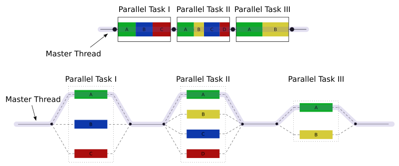
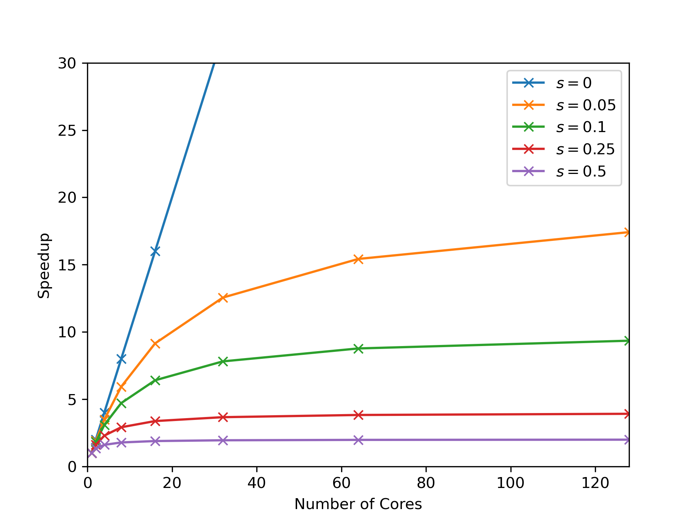

## An introduction to OpenMP

OpenMP is a way of parallelising C++ and Fortran code for multi-core, shared-memory systems. It can also offload computations to accelerators like GPUs but we won't go into that here.

The way we use OpenMP is through **preprocessor directives**, statements that augment our code to give extra information to the compiler, allowing it to parallelise the code automatically. We'll describe the syntax for these directives in a later section but as a very quick example of what OpenMP looks like, this is how we can parallelise a loop using a `parallel for` directive:

```cpp
#pragma omp parallel for
for(...) {
  // perform some independent loop iterations
}
```

That's it! Adding just one line before a loop we want to parallelise is how simple OpenMP *can* be. Of course, OpenMP exposes much more functionality, allowing us to parallelise more complex code, and optimise *how* OpenMP parallelises our code. We can also use OpenMP to introduce some subtle and dangerous bugs (this is C++ after all) but at its core, OpenMP is a remarkably accessible way to program for shared-memory machines and has become standard in the HPC world for this purpose.

OpenMP is a deep and rich way to express parallelism within our code, and the directive-based approach allows us to support a version of our code compiled *without* OpenMP. **If we compile this code without informing the compiler we wish to use OpenMP, it will simply ignore the directives and treat it as sequential code.** 

I should also note that OpenMP has many more features than the basic functionality I'll discuss here. Much like C++ itself, OpenMP is not a library or a piece of software but a *specification* which is continually evolving, with the latest 5.2 version being released in Nov 2021. Compiler developers will implement parts of the specification as appropriate for their userbases and support in GCC at least is minimal for the very latest features. See the [OpenMP page in the GCC wiki](https://gcc.gnu.org/wiki/openmp) for details on compatibility with the current specification.

### Compiling OpenMP code

Enabling OpenMP is (surprisingly) as simple as its basic usage. Let's look at how we can enabled OpenMP using either `g++` only or as part of a CMake project.

#### Compiling with `g++`

If we're using `g++` to compile our program as `g++ -o hello hello.cpp` then all we need to add is the OpenMP flag:

```bash
g++ -fopenmp -o hello hello.cpp
```

Other compilers have similar flags and, as previously mentioned, support different parts of OpenMP, although all compilers should support the basic features.

#### Compiling with CMake

Stealing this snippet from the excellent [Modern CMake](https://cliutils.gitlab.io/modern-cmake/chapters/packages/OpenMP.html), we can add OpenMP to a CMake project (using CMake 3.9+) with:

```cmake
find_package(OpenMP)
if(OpenMP_CXX_FOUND)
    target_link_libraries(MyTarget PUBLIC OpenMP::OpenMP_CXX)
endif()
```

### What is `#pragma omp`?

Every OpenMP directive starts the same way:

```cpp
#pragma omp ...
```

You have already seen a similar kind of preprocessor directive when including header files! For example, `#include <iostream>` tells the C++ **preprocessor**[^preprocessor] to paste the contents of the iostream header directly into the C++ file to make the header's contents available to that file. When writing your own headers, you may have also come across a pragma directive: `#pragma once`. This specific directive tells the preprocessor to *only* include the header file if it has *not* already been included somewhere earlier in the chain of included files. If you've seen older headers, you may have also come across `#define` and `#if` to create **include guards** around the contents of headers, which allow the preprocessor to similarly avoid including a header multiple times in one file. 

[^preprocessor]: You may not have had to learn much about the preprocessor while using modern C++. It is used far more widely in older C++ and in C and, really, modern C++ has better built-in ways to provide the same functionality the preprocessor provides. At a high level, it is a text processor that can understand specific directives like `#include` and manipulate the text in C++ files appropriately. In C++ development you likely won't need to know much more than this.

OpenMP uses its `#pragma omp` directives to control automatic parallelisation in code. If this is a little confusing at this stage, don't worry, it will become clear as you start playing with the OpenMP constructs through some examples.

### Parallelising a loop

We've already seen an example of loop parallelisation:

```cpp
#pragma omp parallel for
for(...) {
  // perform some independent loop iterations
}
```

This **construct**[^construct] actually combines two ideas:

- creating a **parallel region** to spawn some **worker threads**
- splitting up a loop's work between the threads

[^construct]: In OpenMP **construct** is the term for a region of code that OpenMP acts on, including the directive, so here we are using the `parallel for` construct. We'll see a few more OpenMP constructs as we got through more examples.

The `parallel for` is actually shorthand for two separate constructs which we can explicitly write as:

```cpp
#pragma omp parallel
{
  #pragma omp for
  for(...) {
    // perform some independent loop iterations
  }
}
```

Notice the new set of curly braces which defines a new **scope**. At first this may seem strange, but scope is how OpenMP knows when to end the parallel region (or any other construct that applies to a *region* of code). You should already know about scope from your previous C++ knowledge so I won't explain it here. In C++, loops create their own new scope inside the loop delineated by curly braces, hence why we don't have to add any new braces when using the `parallel for`; it only applies to the duration of the loop. But when using only the `parallel` construct, we have to explicitly tell the compiler where the parallel region starts and ends with curly braces.

The `parallel` directive tells OpenMP that we want to parallelise the piece of code inside the following scope. What this really means is when execution reaches this parallel region, OpenMP will create a **team** of threads, allow any constructs inside the parallel region to use those threads. It then destroys those threads at the end of the parallel region. Specifically, `parallel` is an example a parallel model called **fork-join parallelism**, illustrated in the following diagram[^fork-join-source]:



[^fork-join-source]: Source: <https://en.wikipedia.org/wiki/en:File:Fork_join.svg>

In short, fork-join means the program starts serially with a single thread of execution, forks into more threads when required (in OpenMP, when a `parallel` directive is encountered) and then joins those threads back into the main thread to continue serially until another fork is required.

The `for` construct in this example uses the threads spawned by `parallel` by splitting the iterations of the for loop into chunks and assigning different chunks to different threads. Default behaviour can change based on the compiler and OpenMP runtime but usually the `for` construct will split the loop into as many chunks as there are threads and assign approximately the same number of iterations to each thread. So if there are 16 loop iterations to be performed by 4 threads, you can probably expect one thread to take iterations 0-3, another to take 4-7, and so on. Not all loops are this simple so we'll discuss later how we can optimise the `for` construct by specifying how the iterations are split amongst the threads.

### Example 1: Filling an array

Example source: `01_filling_a_array/` in the [examples repository][examples-repository].

[examples-repository]: https://github.com/UCL-PHAS0100-22-23/week8_openmp_examples

Let's apply a `parallel for` construct to an example where we want to fill an array with values from a moderately expensive function like `sin`:

```cpp
#include <iostream>
#include <vector>
#include <cmath>
#include "timer.hpp"

using namespace std;

int main() {
  const int N = 100'000'000;
  vector<double> vec(N);

  Timer timer;

#pragma omp parallel for
  for(int i=0; i<vec.size(); ++i) {
    vec[i] = sin(M_PI*float(i)/N);
  }

  std::cout << "Time: " << timer.elapsed() << '\n';

  return 0;
}
```

The timer code in the example is relatively simple so I won't explain it in detail, it just starts a timer when it's created and shows the elapsed time when `timer.elapsed()` is called.

Let's build this *without* OpenMP to

1. show that the compiler will simply ignore the pragmas if we don't explicitly tell it to use OpenMP and
2. measure the time of the serial code.

Building this with 
```
g++ main.cpp timer.cpp
```
and running with
```
./a.out
```
prints out the time taken to fill this vector. It should take around a second or so on your machine.

Running on my laptop once, I got a time of 0.98s. Enabling OpenMP, i.e. compiling with
```
g++ -fopenmp main.cpp timer.cpp
```
and again running with
```
./a.out
```
gives me a time of 0.14s. With just one additional line of code, I've managed to speed up my code by around 7x! Given I have an 8-core processor, 8x would be ideal but we'll see later that performance improvements don't usually scaling perfectly with number of cores in parallel computations. We'll discuss later what exactly I mean by 7x but for now just read it as "my code is 7 times faster".

*What performance increase do you see when running on your machine and does it match what you expect from the number of cores in your CPU?*

I should point out here that this performance is when using the default compiler optimisation level `-O0`. If we switch to using `-O2` with 
```
g++ -fopenmp -O2 main.cpp timer.cpp
```
then the serial performance drops to 0.74s and the parallel performance to 0.10, now giving a speedup of 7x. While parallelisation can improve our overall performance greatly, single-core optimisations are still crucial to achieving the best performance possible from a code.

### Example 2: Summing an array (naively)

Example source: `02_summing_an_array/` in the [examples repository][examples-repository].

Let's now sum the array from the previous example. I won't go into the maths but the sum of the array gives us a numerical approximation of the integral $\int_0^1 sin(\pi x)\  \text{dx}$. If we sum the array, multiply it by $\pi$ and divide by $N$ we should get *exactly* $2$. The filling of the vector is the same so I'll only print here the code for the sum itself:

```
double sum = 0.;

Timer timer;

#pragma omp parallel for
for(int i=0; i<vec.size(); ++i) {
  sum += vec[i];
}

double elapsed = timer.elapsed();

std::cout << "Time: " << elapsed << '\n';
std::cout << "Result: " << M_PI*sum/N << '\n';
```

Compiling and running without OpenMP gives:

```
Time: 0.276116
Result: 2
```

This is exactly what we expect. If you enable OpenMP however, you'll probably get something like:

```
Time: 0.957646
Result: 0.14947
```

I recommend you take a break here and think about the questions:

- Why has the time increased with more threads?
- Why is the answer wrong?

Don't worry if it's not obvious, this is a subtle and tricky bug and requires considering what all threads are doing as they access each variable inside the loop. It might be easier to consider the behaviour of just two threads.

---

This behaviour is the result of a **data race**. Consider even just two threads working in parallel, one processing the first half of `vec`, and the other, the second half. Thread 1 reads, say `vec[0]`. It then needs to add this value into `sum`. It reads `sum`, adds `vec[0]` to it and writes that back into `sum`. This addition takes some time however, and thread 2 is performing the exact same operation but using a different value of `i`, say `i=100`. As thread 1 reads `sum` and is currently spending time adding, thread 2 can easily finish an addition and write a new value to `sum`. Once thread 1 has finished adding, it has no idea that thread 2 contributed to the sum and then unknowingly *overwrites* the updated value of `sum` with its own version, accidentally removing the contribution from thread 2. Not only does this mean the value of `sum` is *incorrect* but the CPU *does not allow* threads to write to the same variable at the same time, so each thread must wait for the other to finish, adding more time to the overall calculation. This is why the overall time has increased, despite using multiple threads, and why the result is wrong!

So how do we handle a data race in OpenMP? Each example of a data race is fairly unique and should be handled in its own way, but the general solution is to limit threads to writing to variables no other threads will interact with. We'll look later at how we can avoid this by manually creating private copies of variables but summing is actually part of a larger group of operations called **reductions**, where a large data structure (like a vector) is reduced to a smaller number of values, in this case just a single number. Thankfully, OpenMP provides a way to easily deal with these kinds of operations: **reduction clauses**.

### Example 3: Summing an array with `reduction`

Example source: `03_summing_an_array_reduction/` in the [examples repository][examples-repository].

OpenMP allows constructs to be augmented with **clauses**, extra pieces of information we can add to its directives to further refine the parallelisation. In the above sum example, we can tell OpenMP we're trying to perform a reduction by adding the `reduction` clause to the `parallel for` construct along with the reduction operator and the variable that is holding the value of the reduction:

```
double sum = 0.;

Timer timer;

#pragma omp parallel for reduction(+:sum)
for(int i=0; i<vec.size(); ++i) {
  sum += vec[i];
}

double elapsed = timer.elapsed();

std::cout << "Time: " << elapsed << '\n';
std::cout << "Result: " << M_PI*sum/N << '\n';
```

If you run the above example with OpenMP you should get something like:

```
Time: 0.0667325
Result: 2
```

### The reduction clause

A reduction can be applied to a number of constructs but you'll rarely use it outwith a `parallel for`, certainly for this course. The general syntax looks like:
```
reduction(<operator> : <variable>)
```

`<operator>` can be replaced with one of:

- the arithmetic operators: `+`, `-`, or `*` (notice no division)
- either `max` or `min`
- the logical operators: `&`, `|`, or `^`
- the bitwise logical operators: `&&` or `||`
- a custom operator defined through the `declare reduction(...)` directive

While it's useful to know what's available, you'll probably find yourself using only the arithmetic operators and `max` or `min`.

`<variable>` can be a variable of any type *that supports the given operator*. I tend to limit these variables to built-in types mainly because the reduction operator implicitly copies the given variable which can be tricky to handle for complex types or classes. If you want to use complex types, you must be careful to make sure the type has copy constructors that manage any type-owned resources appropriately.

For (much) more detailed information on everything I haven't mentioned about the reduction clause, see [the reduction clause in the specification](https://www.openmp.org/spec-html/5.0/openmpsu107.html).

### How many threads does OpenMP create?

By default, OpenMP will use as many threads as there are cores. You can find this information out on Linux machines by running the command `nproc` and on other systems you should be able to find this out from the System Information part of your settings. Some CPUs support a technology called hyperthreading which can convince the OS there are twice as many cores as there are physically located in the CPU. For example, on my 8-core laptop, `nproc` returns `16` because of hyperthreading and OpenMP will use 16 threads as a result. Strictly, the CPU cannot perform more tasks in parallel than available cores so we almost never gain performance by using more threads than available cores[^hyperthreading]. Regardless, we can tell OpenMP how many threads to use manually, either in code or through environment variables.

[^hyperthreading]: You may wonder why hyperthreading exists at all if it doesn't improve performance but it isn't designed for HPC applications, it's designed to better support desktop applications.

### Example 4: Specifying threads in OpenMP

Example source: `04_changing_num_threads/` in the [examples repository][examples-repository].

The standard way to specify the number of threads OpenMP uses in any parallel region is by setting the `OMP_NUM_THREADS` environment variable. In Bash, the shell you use in the terminal window of VSCode when using the devcontainer, this can be set for the duration of the session with:

```bash
export OMP_NUM_THREADS=2   # For two threads
./my_openmp_program        # will run with 2 threads
```

Or it can be set only for the duration of a single program:

```bash
OMP_NUM_THREADS=4 ./my_openmp_program # will run with 4 threads
```

You can set the number of threads in code with the function `omp_set_num_threads(int)` but unless you have a good reason to do so, I recommend using the above environment variable method. This is much more standard in the OpenMP community.

Let's use this in our previous example and see how our program behaves with different numbers of threads. I've started with the same code from example 3 but now we print out the maximum number of threads available to OpenMP with `omp_get_max_threads()`. I've also had to include `omp.h` to gain access to that function.

You should compile with `g++ -fopenmp -O2 main.cpp timer.cpp` and test the serial performance, this time not by removing `-fopenmp` but by running `OMP_NUM_THREADS=1 ./a.out`. On my machine that gives:

```
| 1 | 0.0704976 |
```

Without recompiling, I can run `OMP_NUM_THREADS=2 ./a.out` and get:

```
| 2 | 0.0372252 |
```

Setting `OMP_NUM_THREADS` to every value up to 8 gives the following table of data on my 8-core laptop:

| `OMP_NUM_THREADS` | Time (s) |
|---|---|
| 1 | 0.0704976 |
| 2 | 0.0372252 |
| 3 | 0.0257015 |
| 4 | 0.0206777 |
| 5 | 0.0216401 |
| 6 | 0.023578 |
| 7 | 0.0253431 |
| 8 | 0.0270154 |

What we've actually done here is a **parallel scaling** experiment, testing how well our parallelisation performs as we gradually add more processing elements. Clearly on my machine, I get some good improvements up to 4 threads, then the performance gets worse if I add any more. How does the performance scale on your machine?

### Parallel scaling: Strong scaling

In example 4 we were able to measure the **parallel scaling** of our parallelisation. In particular, we measured the code's **strong scaling** performance, that is keeping the **problem size** constant and measuring how the runtime changes with the number of threads. We can experiment with other kinds of important measures like memory and power scaling instead of runtime but most scaling experiments focus on measuring the runtime performance so that is what we'll focus on here.

A useful measure when measuring scaling is **speedup**, a measure of how much faster a code completes when run with a higher number of threads. In parallel programming this is usually calculated as the ratio of the single-core time to a higher-core time. In the previous example the speedup I achieved moving from 1 to 4 threads was approximately $0.07/0.021 = 3.33$. This can be written as "3.33x" as in "3.33 times the single-core speed" or even just $3.33$ when it's obvious it's referring to a speedup.[^speedup]

[^speedup]: Speedup doesn't just refer to speedup due to adding more threads to a parallel code. Any time we change a code and make it run faster, we can measure the speedup as the old runtime divided by the new runtime.

While problem size is relatively easy to quantify in the sum example; it's just `N`, the number of items in our vector, it's not always so straightforward. In my own experience, there tends to be one or two obvious numbers that represent the overall problem size but unfortunately there is a bit of an art to identifying a variable within a complex code that can act as a measure of "problem size". Many problems will have multiple ways to measure their size in some sense, so scaling experiments may be run by varying different variables to understand how the parallelisation affects different aspects of a given problem.

#### Strong scaling

There are two main kinds of parallel scaling found in HPC literature: **strong scaling**, keeping the problem size constant and changing the number of thread, and **weak scaling**, changing the problem size *and* the number of threads by the same factor. In a strong scaling experiment we decrease the amount of work per thread as we increase the number of threads, but in a weak scaling one the amount of work per thread stays constant.

### Example 5: Weak scaling

Example source: `05_weak_scaling/` in the [examples repository][examples-repository].

Let's now run a weak scaling experiment using the same code as example 4, but this time we will increase the problem size by the same factor as we increase the number of threads; if we double the number of threads, we will also double `N`. In practice, we will simply multiply the initial problem size by the number of threads inside the code. The code is so similar to the previous example I won't print it here but you should read through it to make sure you understand what's going on. Now, as I increase `OMP_NUM_THREADS` from 1 to 8 I see my time increase slowly from 1 threads to 4 then more quickly from 5 threads to 8:

| `OMP_NUM_THREADS` | `N` | Time (s) |
|---|---|---|
| 1 | 100000000 | 0.0704839 |
| 2 | 200000000 | 0.0727549 |
| 3 | 300000000 | 0.0746549 |
| 4 | 400000000 | 0.0785764 |
| 5 | 500000000 | 0.101448 |
| 6 | 600000000 | 0.135992 |
| 7 | 700000000 | 0.185243 |
| 8 | 800000000 | 0.205911 |

What does this data say about the parallelisation or even my hardware? We see *nearly* ideal scaling changing the number of threads from 1 to 4 (remember ideal weak scaling looks like constant time with increasing threads and problem size). Nearly ideal in this case means it only increases very slowly, i.e. the speedup is just larger than $1$. This is good, we now know we can run problems 4 times as large in nearly the same amount of time if we use 4 times as many threads (for smaller number of threads). The frankly terrible scaling after that, when using 5 threads to 8, suggests that there is possibly some fundamental difference between some of the cores in my CPU, where using them slows down the overall computation. Or, perhaps my CPU is throttling its speed to control its temperature as I try and use more cores. If I were measuring a real code, at this point I would probably run a similar experiment on a different CPU to try and understand better what is happening.

### Why measure scaling performance?

In example 4 we saw that, on my machine at least, providing 4 threads gave us the best runtime performance. In fact, if I naively assumed my code runs fastest with the most number of threads, I'd end up waiting nearly 30% longer for my results. I couldn't have known that information without performing some scaling experiment. So if I'm not making any changes to my code, I know I should just run this with 4 thread for the best performance. If I am willing to do more work, I could start with this data and begin optimising my code for higher thread counts. Perhaps there is a different sum algorithm I can use that works better for high thread counts, or perhaps there are some options within OpenMP I haven't considered. Performing a parallel scaling experiment is the first step to improving the overall performance of my code. This data also tells me something about how I should expect my code to run on other machines. If I didn't have the data I could (again) naively assume my code could be faster on a machine with more cores, perhaps leading me to waste resources on gaining access to a machine with cores my code can't even use.

In short parallel scaling experiments allow us to:

1. Find the ideal number of threads for the best performance on a given machine.
2. Inform optimisation efforts.
3. Suggest how the code will run on different hardware.

We measure *both* strong and weak scaling because they help us better understand how we can use our code to achieve our science goals *in different ways*. If I have very good strong scaling, that is my code gets significantly faster when I add more threads, I know I can run similarly sized problems in less time if I just have a bigger computer. If I have very good weak scaling, I know I can run much larger problems on a larger machine and they should run in about the same amount of time. Strong and weak scaling characteristics can vary independently; some codes will scale very well in a strong sense, but not well in a weak sense, and vice versa. If your code doesn't scale well in either I suggest you rewrite your algorithm or look at your parallelisation.

Scaling itself can even change as a function of problem size or number of threads. Many linear algorithm packages will use different algorithms for different problem sizes because the scaling changes with the problem size. Similarly, you may find an algorithm that performs poorly at lower thread counts actually becomes better than alternatives with higher thread counts.

### Ideal scaling: a fantasy?

The **ideal scaling** or **perfect scaling** in a strong scaling experiment would be a linear improvement in performance with an increase in threads, i.e. if I double the number of threads I use to run my perfectly scaling code, I should expect it to run in half the time, or twice as fast. In terms of speedup, perfect strong scaling implies that the speedup with $N$ threads should be $N$.

In a weak scaling experiment, perfect scaling would result in the code taking exactly the same amount of time as we increase thread count and problem size by the same factor[^superlinear-scaling]. In a perfectly weak scaling code, the speedup should be exactly $1$ with any number of threads[^problem-size-weak].

[^superlinear-scaling]: There are some circumstances where we can actually achieve better than perfect scaling, or superlinear scaling. It's rather rare so I won't discuss further but look out for the excitement surrounding superlinear parallel codes and (somewhat related) superlinear algorithms.

[^problem-size-weak]: Actually perfect weak scaling may look different for different definitions of problem size, particularly if the problem scales nonlinearly with a chosen measure of problem size.

For most real problems, ideal scaling is impossible to achieve due to most problems containing fundamentally *serial* sections. Even in our sum example, although each thread sums its own piece of the loop, at the end of the loop OpenMP must still add up those individual sums into the final result sequentially. We can quantify the impact of this serial part on our parallel performance through **Amdahl's law**:

$\text{speedup}_{\text{ideal}} = \frac{1}{s + \frac{1-s}{N}}$

Here, $s$ is a measure of the proportion of the code's runtime that *must* happen serially, $N$ is the number of threads, and $\text{speedup}_{\text{ideal}}$ is the best possible speedup we can achieve using $N$ threads. I recommend you convince yourself this is correct. The way I do this myself is my considering that if my runtime is $1$s, it is split between $s$ seconds spent serially and $1-s$ spend possibly in parallel. With perfect strong scaling, that $1-s$ runtime should decrease as $(1-s)/N$ for $N$ threads, but my serial portion takes the same amount of time, so my total runtime becomes $s + (1-s)/N$. My speedup is then the inverse of this, which is Amdahl's law.

So, for example, if I'm able to parallelise a portion of my code I *know* takes 80% of the runtime, leaving 20% running serially, $s=0.2$. If I have $N$ cores available, Amdahl's law tells me I can achieve *at best* a speedup of 2.5x. This is significantly lower than the ideal speedup of 4x using 4 threads. With 16 threads, I can achieve a maximum speedup of 4x.

You can see that if only 80% of your code's runtime is parallelised, we reach a point of diminishing returns very quickly in terms of the number of threads we can offer our code. Because of the nonlinear nature of Amdahl's law, for *any* value of $s$ we will eventually reach a point where adding more threads doesn't provide a meaningful improvement in performance. In fact, if we imagine $N$ going to infinity in the above equation, we see the parallel part of Amdahl's law, $(1-s)/N$, becomes insignificant compared to $s$, and so the ideal speedup with infinite threads is $1/s$. You can begin to see that in the following plot of Amdahl's law for different values of $s$:



Just like our scaling experiments, Amdahl's law provides a useful guide in helping us understand the limits of our code's parallelisation. With a code that spends a significant amount of time performing work serially, we're better off spending our time trying to parallelise the dominant serial parts or trying to at least optimise them to reduce their contribution to the runtime, rather than trying to run our code on a machine with more threads.

### Data sharing

We've seen an example of a data-race in the earlier naive sum example. As discussed, these happen when multiple threads try to write to the exact same memory location. Data-races are part of a larger problem in parallel programming of ensuring threads access memory *safely*. Reductions avoid threads touching the same memory locations by implicitly creating **private** variables for each thread. In the reduction example, what OpenMP actually does is make one copy of `sum` per thread and that private copy is the variable the thread interacts with.

To be clear, memory safety is only really a problem if any threads are writing to a location while others are trying to either read from or write to it. Even if one thread is writing and all others are reading, you can still create subtle bugs when reading and writing happen in an unspecified order. If all threads are only reading from the same memory location, it's nearly always fine to allow those shared access. This also only applies to *entire* variables. *It is perfectly safe to have different threads accessing different parts of a container, for example a vector, as long as they do not access the same items.* In general, if any threads write to a memory location that others will access, you should consider declaring the associated variable private, or controlling access to it in another way through thread control clauses, which we will discuss later.

We can declare variables private manually with the `private` clause added onto a `parallel` construct. This clause lets OpenMP know that each thread should have its own copy of the data. `private` is just one of several **data sharing clauses** that allow us to give OpenMP more information about how variables will be used in a parallel region. These commonly used clauses are:

- `shared` - threads access the exact same variable (default)
- `private` - threads access copies of the variable (uninitialised)
- `firstprivate` - same as `private` but initialised from value before clause
- `lastprivate` - same as `private` but *last* iteration of loop gives value to variable after the loop ends

These clauses are attached to `parallel` constructs like:
```
#pragma omp parallel private(i, j, my_var, other_var)
{
  ...
}
```
or
```
#pragma omp parallel for firstprivate(my_var, other_var) private(my_var2)
for(...) {
```

We can also change the default behaviour by specifying it with `default(<clause>)`:
```
#pragma omp parallel for default(private) firstprivate(my_var, other_var)
for(int i=0; i<10; ++i)) {
```

The default clause can be set to `default(none)` to ensure every single variable used in a parallel region is explicitly listed in a data sharing clause. It can be useful to be explicit with your data sharing to make debugging easier (and you will be debugging). There's another subtle default behaviour: *variables defined inside a parallel region are, by default, private*. For instance, the loop variable, `i` in the above example, will be private to each thread.

There are more details on data sharing clauses that will be useful if you use OpenMP beyond this course so do make sure you're aware of the [data sharing clauses section of the specification](https://www.openmp.org/spec-html/5.0/openmpsu106.html). These clauses are relatively simple to understand but can be subtly tricky to use so let's go through a few illustrative examples.

### Example 6: Data sharing

Example source: `06_data_sharing/` in the [examples repository][examples-repository].

Consider the following snippet from example 6:

```cpp
int a = -1;

cout << a << endl;

#pragma omp parallel
{
  a = omp_get_thread_num();
}

cout << a << endl;
```

Here we've used `omp_get_thread_num()` inside a parallel region to fetch the **thread number**, an integer uniquely identifying each thread. Compile this with `g++ -fopenmp main.cpp` and run `./a.out`. What do you expect to happen? Run the code *multiple times* and you should see something like:

```
$ ./a.out
-1
6

$ ./a.out
-1
2

$ ./a.out
-1
4

$ ./a.out
-1
14
```

Because the default behaviour is shared, all threads write to the same memory location but the order in which they write is unspecified, so `a` holds the index of the last thread to access it.

What if we remove the default behaviour?
```cpp
int a = -1;

cout << a << endl;

#pragma omp parallel default(none)
{
  a = omp_get_thread_num();
}

cout << a << endl;
```

You shouldn't even be able to compile the code! I get an error using g++ 12.2.1 that looks like:
```
main.cpp: In function ‘int main()’:
main.cpp:14:7: error: ‘a’ not specified in enclosing ‘parallel’
   14 |     a = omp_get_thread_num();
      |     ~~^~~~~~~~~~~~~~~~~~~~~~
```

Let's make sure `a` is included in a data sharing clause:
```cpp
int a = -1;

cout << a << endl;

#pragma omp parallel default(none) private(a)
{
  a = omp_get_thread_num();
}

cout << a << endl;
```

Now compiling and running this code should print:

```
-1
-1
```

So why hasn't `a` been changed at all? By declaring it private, we've asked OpenMP to create a whole new copy and give that to each thread, we haven't told OpenMP to do anything with those copies afterwards, so it simply destroys them and the code after the loop uses the untouched, original variable `a`.

We can even see what's going on inside the parallel loop by printing out `a`:
```cpp
#pragma omp parallel default(none) private(a) shared(std::cout)
{
  std::cout << a << std::endl;
  a = omp_get_thread_num();
  std::cout << a << std::endl;
}
```

Notice we've had to declare `std::cout` as shared so our threads can access it. On my machine, if I run with `OMP_NUM_THREADS=2` I get:

```
-1
3272332723

0
1
-1
```

Running multiple times will give different variations on this output, all of which look a little... *weird*. The first and last line are our original printing of `a`, and the lines `0` and `1` are the printing of the correct thread indices, but the line `3272332723` reveals two things: the threads are printing out of order so quickly that their output has been interleaved on the same line, this is actually each thread printing `32723` once. It also reveals that the value of `a` before it is set by each thread is nonsense, indeed `private` data sharing is defined so that the variable is *uninitialised* at the start of the parallel region. We can modify this behaviour using the related `firstprivate` clause:
```cpp
#pragma omp parallel default(none) firstprivate(a) shared(std::cout)
...
```

Now the output from the threads will still print out-of-order but we can see the first printing of `a` by each thread shows that OpenMP copied the original value when it created the private copies of `a`:
```
-1
-1
1
-1
0
-1
```

### Thread control: Single

Sometimes when we run parallel programs we want to be able to control precisely when or how often our threads perform certain operations. A good example is printing output. Let's say we need to print *inside* a parallel region. We've already seem examples where different threads all trying to print at once can produce unhelpful results. Instead, we can using the `single` construct to tell OpenMP that *only one thread* should run the code inside the construct. For example if we want to print out a value inside a parallel region before we're finished with the full computation:

```cpp
int sum1 = 0;
int sum2 = 0;

#pragma omp parallel
{
  #pragma omp for reduction(+:sum1)
  for(...) {...}

  #pragma omp single
  {
    std::cout << sum1 << std::endl;
  }

  #pragma omp for reduction(+:sum2)
  for(...) {...}
}
```

This code will print out once the value of `sum1`. This example is loosely based on [Jaka Špeh's blog post on single](http://jakascorner.com/blog/2016/06/omp-single.html) so check that out for a more detailed example and some alternative ways to program this particular situation.

### Example 7: Critical

Example source: `07_critical/` in the [examples repository][examples-repository].

A similar construct is `critical`, which guarantees that threads will only run the code in the construct one at a time, i.e. sequentially. We can investigate this with a silly code that prints a very muddled output. Here, each thread prints its own index, calculates and prints a relatively slow function (here, a single value of sin), and then prints its own index again:
```cpp
#pragma omp parallel default(none) shared(std::cout)
  {
//#pragma omp critical
    {
      const int thread_num = omp_get_thread_num();
      std::cout << thread_num << std::endl;
      std::cout << std::sin(M_PI*(thread_num+1)/4) << std::endl;
      std::cout << thread_num << std::endl;
    }
  }
```

Running with 4 threads, we should see the numbers 0, 1, 2, 3 printed twice each, and 4 different floats printed as well. On my machine this prints:

```
0
2
1
31
1

0.7071071.22465e-16
3

0
0.707107
2
```
Indeed, we seem to have all the numbers expected somewhere in the output but it's a mess and running this multiple times shows the output changes each time, as we've come to expect from the unspecified order in which the threads print. Uncommenting the `critical` clause tells OpenMP to run the piece inside the scope *one thread at a time*. The output now looks like:

```
0
0.707107
0
2
0.707107
2
1
1
1
3
1.22465e-16
3
```

Although the order in which each thread runs is still unspecified, and this order will change each time we run this code, we can clearly see that each thread completely finishes printing before the next begins. Of course, in this example we're now running our code entirely serially but in real code `critical` can be useful.

### Thread control: Barrier

Another useful control directive is `barrier` which allows each thread to **synchronise** at the point each thread reaches the construct. For example, if we need to dump some simulation data to a file, we may need to ensure all threads have finished updating that data before it's saved. We can do this by specifying a single `barrier` construct at the point we need the threads to wait:
```
vector<float> data;

#pragma omp parallel
{
  #pragma omp for
  for(...) {
    data[...] = ... // update data as part of the simulation
  }

  #pragma omp barrier // ensure all threads synchronise here

  save(data);
}
```

We must be careful when using `barrier` because any threads that reach a barrier construct will wait for *all other threads* to also reach a barrier construct. If just one thread takes an alternative path through the code and doesn't reach a barrier, the other threads may wait forever. This is an example of a **deadlock**.

### Example 8: Deadlock

Example source: `08_critical/` in the [examples repository][examples-repository].

Consider the following code where the thread with index 0 takes a different path through the `if` statement which *doesn't include a barrier*:

```cpp
#pragma omp parallel default(none) shared(std::cout)
{
  const int thread_num = omp_get_thread_num();

  if(thread_num == 0) {
    std::cout << "I've caused a deadlock!" << std::endl;
  } else {
#pragma omp barrier
  }

#pragma omp critical
  std::cout << "I'm thread " << thread_num << std::endl;
}
```

Compiling with `g++ -fopenmp main.cpp` and running with 4 threads prints:
```
I've caused a deadlock!
I'm thread 0
I'm thread 1
I'm thread 2
I'm thread 3

```
The executable then hangs, with threads 1-3 waiting for thread 0 to reach a barrier. You might think only thread 0 should print its index because the other threads should be waiting at the their encountered barrier, but this behaviour reveals an **implicit barrier** at the end of the `parallel` construct. When thread 0 reaches this implicit barrier, it releases the barrier on all other threads which then print their indices and wait at the implicit barrier at the end of the parallel block. Since thread 0 has already reached this barrier and finished its execution, the remaining threads will wait indefinitely and the execution stops but never completes, or the execution "hangs".

You should run the same example and see if your code behaves in a different way. Because we have unmatched barriers in the code, this is technically undefined behaviour and we can't rely on OpenMP to perform the same way on different systems.

Helpfully, the compiler will stop you from trying to use barrier in certain circumstances, like inside `single` blocks:
```cpp
#pragma omp single
{
  std::cout << "I've caused a deadlock!\n";
#pragma omp barrier // This won't compile!!
}
```
The compiler will only catch these kinds of bad uses of `barrier` in particular circumstances however; you should be very careful using barriers in situations where some *but not all* threads may reach a barrier.

### Thread control: Implicit barriers and `nowait`

In the previous example we encountered an **implicit barrier** which synchronises threads at the end of certain blocks. The constructs that include implicit barriers include:

- `for`
- `single`
- `sections`
- `parallel`

If it's not crucial to the correctness of the program, this implicit barrier can be removed by including the `nowait` clause:

```cpp
#pragma omp single nowait
...
```

This is often a good way to improve performance in certain sections of code where some threads may take significantly longer than others to complete, but do be careful to ensure correctness when removing any barriers.

### Paralleling loops: Schedules

While simple examples of parallel loops tend to be **well-balanced** in that every loop iteration takes a similar amount of time, in real codes some iterations may take longer than others. When parallelising these kinds of unbalanced loops, we can improve our parallel performance by specifying a **schedule** in a `for` construct:
```
#pragma omp parallel for schedule(static)
for(...)
```

OpenMP does not have a universal default schedule; it is implementation-dependent. Let's go through each one:

**static**

The `static` schedule is probably the simplest to conceptualise. The loop iterations are split into chunks of equal size. Each thread is assigned its chunks *before the execution begins*. If we do not specify a chunk size, OpenMP will split the loop into approximately equal pieces and assign, at *most*, one chunk to each thread. We can specify the chunk size in the `schedule` clause:

```cpp
#pragma omp parallel for schedule(static, <chunk_size>)
```

Because the threads are assigned their chunks prior to execution, there is no easy way to balance the loop as it's running. This motivates the next schedule.

**dynamic**

The `dynamic` schedule operates nearly the same as `static` but threads are assigned chunks one at a time. Each thread will process its chunk and request a new one once it has completed. This means if certain chunks take significantly longer than others to process, threads that finish quicker can process chunks that would have been assigned to a slower thread by the static schedule. The dynamic schedule is slightly slower than `static` due to the runtime overhead so should only be used if it's known that the loop could be unbalanced.

**guided**

The `guided` schedule is similar to the dynamic schedule in that chunks are assigned to threads as the loop runs, but the chunk size actually decreases as the loop progresses. The chunk size given to the schedule clause is used as the *minimum* chunk size. This can be useful in balancing loops but, as with dynamic, can be slower than a well-balanced, static schedule.

**runtime**

The `runtime` schedule delegates the choice of schedule to the environment variable `OMP_SCHEDULE`.

**auto**

The `auto` schedule delegates the choice of schedule to either the compiler or the runtime.

### Example 9: Schedules

Example source: `09_schedule/` in the [examples repository][examples-repository].

Let's modify example 1 to unbalance the loop:
```
int main() {
  const int N = 100'000;
  vector<double> vec(N);

  Timer timer;

#pragma omp parallel for schedule(runtime)
  for(int i=0; i<vec.size(); ++i) {
    vec[i] = sin(M_PI*float(i)/N);

    bool is_thread_even = (omp_get_thread_num()%2 == 0);
    if (is_thread_even) {
      std::this_thread::sleep_for(std::chrono::microseconds(1));;
    }
  }

  std::cout << timer.elapsed() << '\n';

  return 0;
}
```

While the computation is the same as in example 1, in this example all threads with an even index will now sleep for a microsecond per iteration, artificially slowing those threads down. I've also added the `runtime` schedule to the `parallel for` so we can experiment with the different schedules, and lowered `N` to ensure the code runs in an appropriate time. Compiling with
```
g++ -fopenmp -O2 main.cpp timer.cpp
```
and running with
```
OMP_NUM_THREADS=4 OMP_SCHEDULE=static ./a.out
```
prints a runtime of `1.53`. Changing `static` to `dynamic` and `guided` gives the following data:

| Schedule | Time (s) |
|---|---|
|static | 1.53 |
|dynamic | 0.00421|
| guided |0.664 |

It's clear that, for this specific problem with a particularly unbalanced loop the dynamic schedule works best.

If we comment out the sleep to re-balance the loop, and set `N=10'000'000` to allow the code to run for long enough that the runtimes are meaningful, the schedules offer distinctly different performances:

| Schedule | Time (s) |
|---|---|
| static | 0.0513 |
| dynamic | 0.178 |
| guided | 0.0226 |

Now, the overhead when using the dynamic schedule is prohibitively expensive compared to either the static or dynamic schedules, but (perhaps surprisingly) the guided schedules proves nearly twice as effective as the static schedule. I reran the experiment 10 times and got roughly the same runtimes so I do trust these results!

### Tuning

You'll notice throughout previous examples that we've encountered some surprises. Sometimes our examples worked better with 4 threads than 8. Sometimes our choice of schedule had a surprising impact on performance. The process of testing and discovering optimal settings for particular hardware is called **tuning**. It is often the case that spending time optimising settings and not code on a supercomputer can improve the performance without having to change a single line of code. It can be a better use of time than optimising the code itself.

### Nested loops

OpenMP also provides different methods of parallelising nested or multi-dimensional loops. If we have the following nested loop:
```cpp
for(int i=0; i<10; ++i) {
  for(int j=0; j<10; ++j) {
    ... 
  }
}
```
Then we can parallelise this in only one dimension, i.e. the outer loop:
```cpp
#pragma omp parallel for
for(int i=0; i<10; ++i) {
  for(int j=0; j<10; ++j) {
    ... 
  }
}
```

In this case each thread will take a chunk of the `i` iterations but perform every single `j` iteration. Alternatively, if each loop iteration is completely independent, we can use the `collapse(<n>)` clause, with `<n>` replaced with the number of loops to collapse, to inform OpenMP that it can safely parallelised across *both loops*:
```cpp
#pragma omp parallel for collapse(2)
for(int i=0; i<10; ++i) {
  for(int j=0; j<10; ++j) {
    ... 
  }
}
```

The two loops in this case will be collapsed into one large loop, the iterations split into chunks and given to threads to process, just like in a non-nested loop. Schedules, reductions and data sharing clauses all work with collapse exactly as you expect.

I would caution against parallelising only the inner loop, for example:
```cpp
for(int i=0; i<10; ++i) {
#pragma omp parallel for
  for(int j=0; j<10; ++j) {
    ... 
  }
}
```
The parallel construct incurs some overhead when as it creates and destroys teams of threads so in this case, it would incur that overhead for every single iteration of the outer loop. If the `j` loop *must* be parallelised for some reason, it would be better to reorder the two loops if possible:
```cpp
#pragma omp parallel for
for(int j=0; j<10; ++j) {
  for(int i=0; i<10; ++i) {
    ... 
  }
}
```

