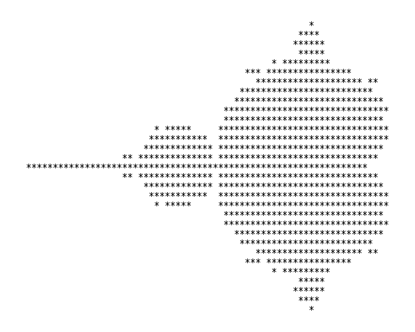

## Example 10: Generating a fractal

Example source: `10_fractal/` in the [examples repository][examples-repository].

In this example we'll combine much of what we've learned in previous sections and apply it to a real problem: the generation of a Mandelbrot fractal.

[Fractals](https://en.wikipedia.org/wiki/Fractal) are shapes or patterns that in some sense contain infinite complexity. I won't go into their (very interesting) mathematical properties but plotting a fractal like the classic Mandelbrot set can produce some beautiful patterns:


The above plot is made by:

1. Turning each pixel with coordinates $(p,q)$ into a complex number $c = p + iq$ where $i^2 = -1$ is the imaginary unit.
2. Using $c$ in the iterative equation $z_{n+1} = z_n^2 + c$ starting from $z_0 = 0$.
3. Iteratively updating $z_n$ until either
    - $\|z_n\| > 2$ or
    - some maximum number of iterations is reached.
4. If the maximum is reached, we consider it *inside* the fractal and if $\|z_n\| > 2$, we consider it *outside* the fractal.

Since we haven't used a graphics program yet, we will reproduce the first ever published image of the Mandelbrot fractal, produced by Robert W. Brooks and Peter Matelski in 1978:



We can compile and run the serial code in `10_fractal` with
```
g++ 01_serial.cpp
```
Running with `./a.out` you should see a printout of the fractal!
```
                                                    *               
                                                  *****             
                                                  *****             
                                                  ****              
                                                *********  *        
                                         ** *****************  *    
                                          ***********************   
                                        ************************    
                                       **************************   
                                     ****************************** 
                                    ******************************  
                        *******     ******************************* 
                     * **********   ******************************  
                      ************ *******************************  
                  ** ********************************************   
***************************************************************     
                  ** ********************************************   
                      ************ *******************************  
                     * **********   ******************************  
                        *******     ******************************* 
                                    ******************************  
                                     ****************************** 
                                       **************************   
                                        ************************    
                                          ***********************   
                                         ** *****************  *    
                                                *********  *        
                                                  ****              
                                                  *****             
                                                  *****             
                                                    *              +
Area of Mandlebrot set = 1.47347
Error = 0.0330163
Time = 34 ms
```
You'll notice we're not just printing out the fractal but also computing its area and comparing to a known value to get an error estimate.

Let's take a moment to walk through the major pieces of the code starting with the options:
```cpp
// Options for plotting Brooks & Matelski
const bool PLOT_ENABLED = true;
const int NPOINTS_X = 68;
const int NPOINTS_Y = 31;

// Options for measuring large-scale performance
//const bool PLOT_ENABLED = false;
//const int NPOINTS_X = 1024;
//const int NPOINTS_Y = NPOINTS_X;

const int MAXITER = 1024;

double x_min = -2.0;
double x_max = 0.42;
double y_max = 0.85;
double y_min = -y_max;

double dx = (x_max - x_min)/(NPOINTS_X-1);
double dy = (y_max - y_min)/(NPOINTS_Y-1);

std::complex<double> z, c;
int n_outside = 0;

std::vector<char> plot(NPOINTS_X*NPOINTS_Y);
```
Here I've defined two sets of options, one that plots the fractal and sets suitable numbers of points in each direction, and another that disables plotting and scales up the number of points in the fractal to `1024`. We also set the maximum number of iterations per point `MAXITER`, some bounds on the fractal area, and calculate the steps in $x$ and $y$ between each point in the grid. This is one way we can use to scale the points in integer, coordinate space to the required domain space. We then create a few variables to be used in the main loop, which is:
```cpp
auto start = high_resolution_clock::now();

// Iterate over entire domain
for(int i=0; i<NPOINTS_X; ++i) {
  for(int j=0; j<NPOINTS_Y; ++j) {
    // Set c to point inside domain
    c.real(x_min + i*dx);
    c.imag(y_min + j*dy);

    // Initial condition for z is c
    z = c;
    bool is_outside = false;

    for (int iter=0; iter<MAXITER; iter++){
      // Iterate z = z^2 + c
      z = z*z + c;

      // If |z| > 2, point is outside Mandelbrot set
      is_outside = std::abs(z) > 2.0;
      if (is_outside) {
        n_outside++; 
        break;
      }
    }

    if(PLOT_ENABLED) {
      if (is_outside) {
        plot[i*NPOINTS_Y + j] = ' ';
      } else {
        plot[i*NPOINTS_Y + j] = '*';
      }
    }
  }
}

auto stop = high_resolution_clock::now();
auto duration = duration_cast<milliseconds>(stop - start).count();
```
Here we start a timer and then enter the main loop. We loop over every point in the domain, setting the value of `c` accordingly. We then set `z=c`, equivalent to $z_n = 0$, and start iterating the equation $z_{n+1} = z_n^2 + c$, checking every time to see if one of our two conditions are met. If the modulus of `z` is greater than 2 then we know that particular point is outside the fractal, otherwise we must iterate until `MAXITER` is reached before deciding this particular point is inside the fractal. If it's considered outside then we increment `n_outside`, used later to calculate the area. If plotting is enabled we also set an appropriate character at that point in the `plot` array depending on whether we've decided the point is inside or outside the fractal. `i*NPOINTS_Y + j` is just the way we address a 2D grid inside a 1D vector. Once the loop has gone through every point, we stop the timer. At the end of this loop what we've really done is go through a large 2D grid of points, testing each one to decide if it is in the fractal or not. This will be the portion of the code we later parallelise.

The final section calculates the approximate area of the fractal by multiplying the *proportion* of points that were found to be inside the fractal by the total area of our domain, and compares to a known value. We also plot the grid at this point if enabled, then print our results:
```cpp
double prop_inside = (double)(NPOINTS_X*NPOINTS_Y-n_outside)/(double)(NPOINTS_X*NPOINTS_Y);
double area = (x_max-x_min)*(y_max-y_min)*prop_inside;
double error = std::abs(area - 1.506484);

if(PLOT_ENABLED) {
  for(int j=0; j<NPOINTS_Y; ++j) {
    for(int i=0; i<NPOINTS_X; ++i) {
      std::cout << plot[i*NPOINTS_Y + j];
    }
    std::cout << "\n";
  }
}

std::cout << "Area of Mandlebrot set = " << area << std::endl;
std::cout << "Error = " << error << std::endl;
std::cout << "Time = " << duration << " ms" << std::endl;
```

Phew! After all that, we're only going to add a single line to parallelise it! The dominant part of our code is the main loop. The iteration over a single point can't easily be parallelised so we'll leave the innermost loop but we should be able to test multiple points at once by parallelising the two outermost loops. Indeed, these are totally independent so we should test if `collapse` improves performance.

### Version 1a: Serial

Just for completeness I'll include the results from the serial code again here, without the plot:

```
Area of Mandlebrot set = 1.47347
Error = 0.0330163
Time = 34 ms
```

### Version 1b: Enabling -O2

Before we even try parallelising, let's see what kind of speedup we get by simply enabling compiler optimisations through `g++ -O2 01_serial.cpp`:

```
Area of Mandlebrot set = 1.47347
Error = 0.0330163
Time = 4 ms
```

In fact, even `-O1` gave a similar level of performance improvements.

### Version 2: Naive parallel for

Let's try a naive parallelisation using just a `parallel for`:
```cpp
#pragma omp parallel for
for(int i=0; i<NPOINTS_X; ++i) {
  for(int j=0; j<NPOINTS_Y; ++j) {
  ...
```

Uh oh:
```
                                                                    
                                                                    
                                                   *          *     
                                       *           *           *    
                                                  *                 
                                       *          *            *    
                                                  *           *     
                                                  *           **    
                                    *             *                 
                                     **           *          *      
                                    ***           **                
                                      *            *                
                                    * **           *           *    
                               *      **                            
                                     **          *           *      
                              *     * **         ***                
                               *    **                              
                                     *             *                
                               *     *            *           *     
                               *                 * *          *     
                              *        *          **          *     
                                     ***         * *          *     
                                       *         * *          **    
                                      **       * * *          **    
                                                * **          **    
                                       *       **  *           *    
                                      **        ****                
                                               *   *                
                                                * **         *      
                                                  **                
                                                  *                +
Area of Mandlebrot set = 3.41337
Error = 1.90689
Time = 2 ms
```

It's certainly faster but it's pretty useless if it gives us an incorrect result. Remember we need to ensure any variables that *should* be private are!

### Version 3: Correct data sharing

We need add a data sharing clause to our `parallel for` to ensure `c` and `z` are appropriately private to each thread. These are set inside the loop so we don't need `firstprivate`, `private` will do:
```
#pragma omp parallel for private(z, c)
```

This gives:
```
                                                    *               
                                                  *****             
                                                  *****             
                                                  ****              
                                                *********  *        
                                         ** *****************  *    
                                          ***********************   
                                        ************************    
                                       **************************   
                                     ****************************** 
                                    ******************************  
                        *******     ******************************* 
                     * **********   ******************************  
                      ************ *******************************  
                  ** ********************************************   
***************************************************************     
                  ** ********************************************   
                      ************ *******************************  
                     * **********   ******************************  
                        *******     ******************************* 
                                    ******************************  
                                     ****************************** 
                                       **************************   
                                        ************************    
                                          ***********************   
                                         ** *****************  *    
                                                *********  *        
                                                  ****              
                                                  *****             
                                                  *****             
                                                    *               
Area of Mandlebrot set = 4.08668
Error = 2.58019
Time = 3 ms
```

This has given us the correct plot but an incorrect area. This is because we haven't yet handled the required reduction for `n_outside`!

### Version 4: Reduction

We add a reduction clause to ensure `n_outside` is summed correctly across all threads:

```cpp
#pragma omp parallel for private(z, c) reduction(+:n_outside)
```

This gives both a correct plot and a much more accurate area:

```
Area of Mandlebrot set = 1.47347
Error = 0.0330163
Time = 3 ms
```

### Version 5: Testing collapse

Now that we're suitably happy our parallelisation is correct, let's see if collapsing the loop can improve performance:

```cpp
#pragma omp parallel for private(z, c) reduction(+:n_outside) collapse(2)
```

Looks somewhat better and our area calculation still looks correct:
```
Area of Mandlebrot set = 1.47347
Error = 0.0330163
Time = 2 ms
```

### Version 6a: Changing the schedule

We know different points require different numbers of iterations to complete, so we should expect this loop to be some what unbalanced. Let's try the different schedules, again by first experimenting with the `runtime` schedule:
```cpp
#pragma omp parallel for private(z, c) reduction(+:n_outside) collapse(2) schedule(runtime)
```

By running with `OMP_SCHEDULE=... ./a.out` and testing the three schedules `static`, `dynamic` and `guided` we get the following runtimes:

| Schedule | Time (ms) |
|---|---|
| static | 3 |
| dynamic | 2 |
| guided | 2 |

This small a problem isn't allowing us to really see much difference between the schedules so let's disable plotting and increase the number of points in each direction to 1024. Compiling and running the same experiment:

| Schedule | Time (ms) |
|---|---|
| static | 312 |
| dynamic | 312 |
| guided | 307 |

Here I've run each schedule 5 times and reported the minimum time in the above table. In your own experiments you can either use the minimum or average time, representing the best case or average runtime, respectively; both are useful quantities.

The data suggest there actually isn't much different between each schedule, and you'll notice if you vary the chunk size for each schedule, you probably can't beat the time you get for the default guided schedule.

### Version 6b: Scaling

This is a relatively simple code so the changes we've made are really all we can do with our current knowledge of OpenMP. If I were to optimise this code further, I would turn to profiling tools to get more information about how many CPU cycles different parts are taking, I'd perhaps look at utilising SIMD instructions, or other CPU-specific optimisations. This kind of algorithm is well suited to GPU architectures so I'd consider porting the code.

Let's see first how our code has improved through all our (correct) versions using the larger domain size:

| Version | Time | Speedup over optimised serial|
|---|---|
| 1a (unoptimised: -O0) | 18056 | 0.135|
| 1b (optimised: -O2) | 2435 | 1.00 |
| 4 (reduction) | 795 | 3.06 |
| 5 (collapse) | 789 | 3.09 |
| 6 (schedule) | 307 | 7.93 |

Firstly, just by enabling compiler optimisations we've improved our runtime by nearly 8x. This is astounding and you should always experiment with your compiler options before even considering making your code more complex by parallelising it. However, by just adding a single line of OpenMP and experimenting with a few clauses, the code is now running an *additional* 8x faster on my laptop. That's a total speed up of 58.8x.

If I were running this code to actually run some computational experiments, I'd want to know how well I can expect it to run on larger machines, so let's perform a scaling experiment. Still using the domain size of 1024 per dimension, I'll increase the number of threads from 1 to 16 in powers of 2. This produces:

| `OMP_NUM_THREADS` | Time (ms) | Speedup |
|---|---|---|
|1| 2439 |1.00|
|2| 1240 |1.97|
|4| 645 |3.78|
|8| 339 |7.19|
|16| 306 |7.97|

What's curious about this data is my laptop only has 8 cores, so I'm surprised (but pleased!) to get an additional speedup when using *more* threads than I have cores. I can only guess my OS is still requiring some use of the CPU and having more threads dedicated to the fractal calculation makes it more likely that it runs over the OS, but I'm not sure.
