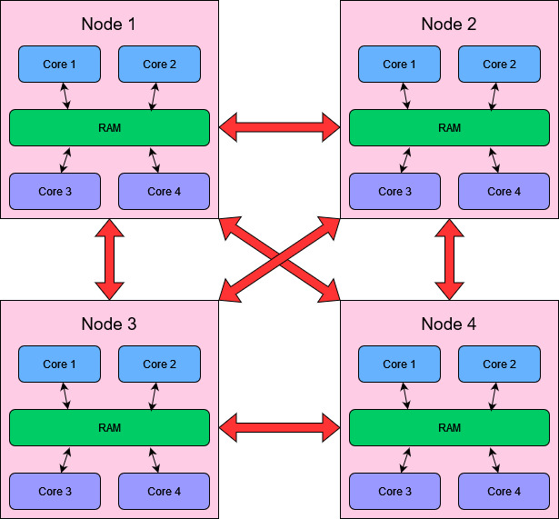
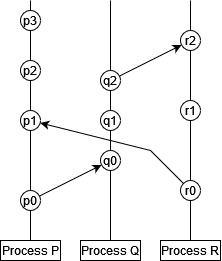
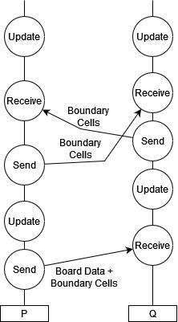
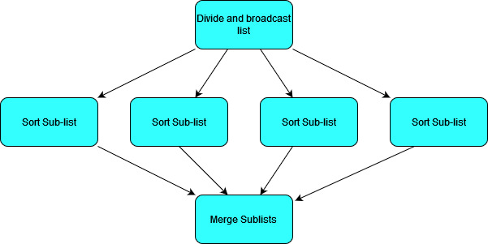
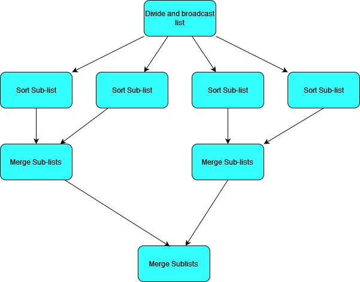
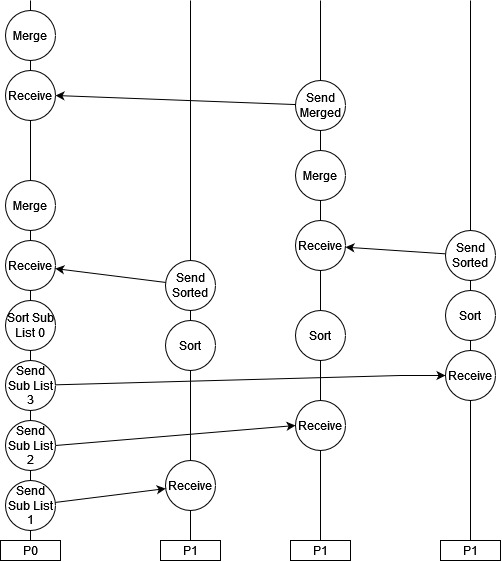

# The Distributed Memory Model of Parallel Programming 

Last week we looked at the use of shared memory parallel programming. As a reminder, the shared memory model is used when each thread has access to the same memory space. 
- Shared memory means that all threads can rapidly access the full data set.*
- Can lead to awkward problems like data races. 
- Sometimes requires additional structures like mutexes to be introduced. 
    - A mutex can refer to any solution which means that a variable can only be accessed by a single thread at a time. 
- The more concurrent threads we have operating on shared memory, the more pressure we put on resources which require access controls like mutexes, which can delay our program execution. 
- Shared memory is limited by the number of cores which can share on-chip RAM. This is generally not a very large number, even for high performance computing resources. The more cores we try to connect to a single piece of memory, the more latency there will be for at least some of these cores, and the more independent ports the memory banks will need to have.

In the distributed memory model, we take the parallelisable part of our program and split it up into independent _processes_. These processes each have their own memory space which cannot be accessed directly by any other process. Processes are however allowed to communicate with one another by sending _messages_; these can be used to send data back and forth between processes where necessary. This message passing is vital for:
- Initialising each process with the correct information. 
- Keeping processes synchronised where necessary (similar to how we used `barrier` in OpenMP).
- Aggregating results from multiple processes into a complete solution. 

Distributed memory programming is incredibly broad and flexible, as we've only specified that there are processes with private memory and some kind of message passing. We've said nothing about what each of the processes _does_ (they can all do entirely different things; not just different tasks but even entirely different programs), what those processes run _on_ (you could have many nodes in a cluster or a series of completely different devices), or what medium they use to communicate (they can all be directly linked up or they could be communicated over channels like the internet). The distributed memory model can apply to anything from running a simple program with different initial conditions on a handful of nodes in a cluster to running a client-server application with many users on computers and mobile devices to a world-wide payment system involving many different potential individuals, institutions, devices, and softwares. It can even apply to separate processes running on the _same core_ or on cores with shared memory, as long as the memory is partitioned in such a way that the processes cannot _access_ the same memory. (Remember when you write programs you use _virtual memory addresses_ which are mapped to a limited subset of memory as allocated by your OS; you generally have many processes running on the same core or set of cores with access to non-overlapping subsets of RAM.) 

For our purposes, we will focus on code written for a multi-node HPC cluster, such as [UCL's Myriad cluster](https://www.rc.ucl.ac.uk/docs/Clusters/Myriad/), using the [MPI (Message Passing Interface) standard](https://www.mpi-forum.org/). We will, naturally, do our programming with C++, but it is worth noting that the MPI standard has been implemented for many languages including C, C#, Fortran, and Python. We will use the [Open MPI](https://www.open-mpi.org/) implementation. We won't be covering much programming in these notes, but focussing on the models that we use and their implications. 

## Aside: Task Parallelism

It's worth addressing the fact that different processes or threads don't need to do identical work. If we need to calculate something of the form:

$y = f(x) \circ g(x)$

then we can assign the calculation of $f(x)$ and $g(x)$ to separate processes or threads to run concurrently. Then there needs to be some kind of synchronisation (using a barrier or message passing) to bring the results together when they're both finished and calculate $y$. 

This kind of parallelism is called _task parallelism_, and can be extremely useful when optimising your code. This is particularly important when the calculations $f(x)$ and $g(x)$ are not themselves parallelisable (at least not to the extent which exhausts your resources). Then, rather than having resources standing idle, you can calculate them both at the same time. If however, $f(x)$ and $g(x)$ both parallelise when to use up all your resources with good scaling, then you will do just as well to calculate one of them after the other rather than calculating them both concurrently but twice as slowly. 

## Basic Structure of an HPC Cluster

The basic model that we need to know is as follows:

- Clusters are composed of _nodes_. 
    - Nodes can communicate with one another through the sending of messages. 
    - The latency associated with message passing may vary depending on the specific structure and connectivity of the nodes. Nodes which are "far apart" in some sense have longer message latency. This factor is difficult to control for unless you are very familiar with your architecture and can control which processes end up on which node, so in general it is not something to worry too much about! 
    - For now we will treat each node as being able to directly communicate with every other node. We can write programs with this assumption because messages can be passed between any two nodes regardless of exact network topology, so this detail is not important unless we are trying to optimise for message passing latency. 
- Nodes can contain multiple _cores_ with shared RAM. 
    - Cores can run independent processes with separate memory spaces (partitioning the shared RAM).
    - Multiple cores can be utilised by a single process with multiple _threads_ and a shared memory approach. In our case this would involve using MPI to spawn and control concurrent processes and using OpenMP to manage threading _within_ a process!
- Threads with shared memory must run on cores within the same node, but processes (which have separate memory) can run on across any nodes or cores.  



This understanding of clusters is important for requesting resources appropriately on an HPC system, as we need to understand how our problem / solution can fit onto the resources that we have! However, the way that your processes interact can look quite different to the diagram of a cluster above, as separate processes can run inside a single node for example. In general we can gain a lot of understanding about distributed systems without thinking about the actual architecture itself, but focussing instead on the _processes_ and the messages that they send. 

## Processes, Message Passing, and Synchronisation

In his [1978 paper](https://amturing.acm.org/p558-lamport.pdf) on "logical clocks", Leslie Lamport was inspired by special relativity to illustrate the concept of communicating processes using a kind of space-time diagram. 

- Processes are described as a sequence of events. 
- Sending a message is a kind of event. 
- Receiving a message is a kind of event. 



In this diagram time runs from bottom to top (i.e. $p_0$ comes before $p_1$), each vertical line is a separate _process_ ($P$, $Q$, and $R$), and each circle is an _event_. An arrow between two events is a message, in which the origin is the message send event and the destination is the message receive event. 

With this understanding, there is a _partial_ ordering of events:

- Events in the same process happen in sequence, so $a$ comes before $b$ if $a$ appears before $b$ in that sequence. 
- Messages must be received _after_ they are sent, so $a$ comes before $b$ if $a$ is an event sending a message and $b$ is the event which receives that same message in a different process. 
- The ordering of events is transitive, so if $a$ happens before $b$ and $b$ happens before $c$, then we can say that $a$ happens before $c$. 

This ordering of events is only partial, because it does not necessarily allow us to compare all events in all processes to one another. In our example above:

- $p_0$ comes before $p_1$, $p_2$ etc. 
- $p_0$ comes before $q_0$, and therefore before $q_1$, $q_1$ etc. 
- We cannot say whether $p_1$ comes before $q_1$ or vice versa. Likewise for $r_1$ and $q_1$ and various other pairings. 

This is a key property of distributed systems: in general we can't say in what order _all_ things occurr across independent processes. Different processes all run independently and can run a different speeds, or have different amounts of work to do. (Lamport's paper goes on to describe the limitations of synchronised physical clocks, and an algorithm for establishing a total ordering across events. This total ordering is non-unique, and the partial time ordering is the only ordering enforced by the actual mechanics of the sytem under study.)

All this is perhaps a lengthy way of saying: **if your processes need to be synchronised for some reason, you need to send messages to do it!**

For example, let's take our Game of Life simulation. At each time step we could partition the board and allow each process to advance its section of the board according to the rules of the game of life. In order to be able to advance the board, we actually need to send a bit of extra information too: the part of the board the process needs to advance, and the cells immediately around that part of the board (let's call these "external cells"), since they will be used in determining the fate of the cells on the boundary of that section. Once we've advanced the simulation by one time step though, we can't go any further: our external cells for each process have not been updated locally, but they get updated in some other process(es)! If we let our process go ahead with this out of date data, we will calculate a wrong result. We need to **synchronise** by broadcasting our boundary cells to the other processes that need them, and waiting for message from other processes which contain the updated external cells that we need. 

Let's illustrate this game of life example using just two processes, $P$ and $Q$. 
- $P$ will send half of the board to $Q$, as well as the external cells that $Q$ needs to update its section. 
- $P$ and $Q$ update their sections in parallel. 
- $P$ and $Q$ exchange information before continuing on to the next update. 



- Here we have one process which must initialise things, which will at the end of all the updates presumably also collect data from the other process to get the final state of the board: this is often the case, but it does not have to be! We could have initialised our processes totally independently and simply allowed them to communicate their boundary cells, with no individual process ever having a complete solution. 
- We cannot say which process will begin or complete its update first, or send its boundary cell data first. It does not matter! The processes are kept synchronised as much as is necessary by the message passing. 
- If one process is faster than the other or the message passing latency is high, then one or more process will stall while waiting to receive the data that it needs. 

## Performance and Message Passing 

Message passing naturall incurs a performance overhead. Data communication channels betweeen processes are generally speaking much slower than straight-forward reads to RAM. As such, when designing distributed systems we should bear in mind:
- The frequency of message passing should be kept down where possible. 
- The size of messages should be kept down where possible. 
- In general, a smaller number of large messages is better than a large number of small messages _for a given amount of data_. 
    - This is true in general of data movement, whether through message passing or memory reads to RAM or hard disks. Loosely speaking, data movement general involves a latency ($L$) and bandwidth ($B$), such that the time for $N$ bytes of data to be transferred is $\sim BN + L$. If we send this data in $k$ separate messages, we will incur a $kL$ latency penalty instead of just $L$. 
    - If you have to choose between sending a smaller amount of total data in a larger number of messages, or a larger amount of data using a smaller number of messages, then which you should pick will depend on which term in this expression becomes dominant! 


## Common Models of Communication in Scientific Programming 

There are some patterns of communication that appear frequently in scientific programming, which often doesn't require the extremely free form approach of more general asynchronous systems!

### Divide, Process, and Aggregate using a Parent process

A straight-forward way of handling many problems is to assign one process the "Parent" process. This is your main process which will initialise your other processes, divide work amongst them, and aggregate data from them. It may or may not do such tasks itself! 

To give the simplest example of how this kind of model can work, let's look at it in the context of the merge-sort algorithm that we used in week 7. (Although sorting a list is not a very practical example as the communication overheads will probably be larger than the sorting time in practical cases, but we'll ignore communication time for now!)
- Merge sort calculates a sorted list by merging together sub-lists which have already been sorted. 
- So if we have $N$ child processes, the parent process can divide our list into $N$ chunks of (roughly) equal size, and ask each child to sort that list and send it back. 
- The Parent process can then merge all the sorted lists. 

We can visualise this as a flow chart like so:



In this case we could actually make things more efficient by allowing some pair-wise communication between child processes to merge sublists. 



In this case instead of one thread merging all sub-lists, we can parallelise over them. As we merge lists pairwise, we will end up with an increasing number of processes idling. 

In these flow charts we have described what needs to be done but not necessarily which processes do it. We want our Parent process to divide the list up and broadcast it, and we want our parent process to end up with the sorted list at the end, but if we want to make the most of our resources we should probably have the parent process do some of the sorting work as well in this case. If we have 4 processes $P_{0...3}$, we could arrange our processes like so:



This kind of pattern of distributing work and aggregating results often happens in a loop, so that we have the division of a task followed by a central synchronisation, followed by a divided task again and so on. 

### Communication On Grids

Grids are a common feature in scientific programming, from lattices in solid state physics and grid methods for fluid simulations, to image processing techniques. Lots of data gets defined on grids, and the processing of this data is often dependent on the data immediately surrounding it in the grid. The game of life was a simple example of this very principle! 

The highly connected nature of grids gives raises an important question for distributed memory systems: what is the most efficient to divide up a grid so that we minimise our message passing? If we want to minimise the frequency and size of our messages between processes, then we need to minimise the number of cells along the boundary of the regions delogated to each process. 


If we want to allocate this grid to four processes, how could we proceed? A simple approach would be to just split it into four vertical sections like so:


Here we've coloured the regions in four different colours to show the allocation to different processes. Any cells on the border of the coloured region will need to be broadcast to the neighbouring region(s). 
- The red and blue regions each broadcast and receive 8 cells to one other region. 
- The yellow and green regions broadcast and receive 16 cells each, split between two regions.
- In total we need to send 48 out of 64 cells, and send 6 messages. 

We can divide up this region to reduce the number of cells on the boundary by dividing the grid into squares:


- In the simplest implementation each region needs to send 9 cells in three messages: for example the red region sends it bottom row to the yellow (4 cells), its right most column to the blue (4 cells), and its bottom left cell to the green (1 cell). 
- Doing it this way would result in sending 36 cells across 12 messages, so fewer cells but more messages. 
- We can do this using fewer messages however if we introduce some blocking i.e. we make some processes wait to receive data before sending data so that they can forward on shared data. This tends to lead to time idling though! 

Which solution and message passing pattern is most efficient may depend on your system and the message passing latency and bandwidth properties! If your message passing time is dominated by bandwidth, you should try to minimise the amount of data communicated (i.e. smallest number of boundary cells); if your message passing time is dominated by latency, you shoudl try to minimise the number of messages that you send. For problems which have to communicate large amounts of data, the message passing time will likely be bandwidth dominated and so a smaller boundary is the preferable solution. 

## Putting Things Together: Performance at Every Scale 

Over the last few weeks we've looked at a few different ways of approaching performance programming in isolation, but it's important to remember that we can (and should!) combine these principles where appropriate. 

### Mixing Distributed and Shared Memory Models

Distributed memory models have a lot of advantages in terms of simplifying memory management and, generally speaking, allowing for a greater amount of flexibility and scalability. However, data sharing in distributed systems is slow, which makes them very poorly suited to parallelising certain kinds of problems, especially those which are _memory bound_. There'd be no point in using a distributed system to transpose a matrix in parallel because passing the matrix components between processes would take longer than the memory reads to perform the transpose itself! But a matrix transpose _does_ parallelise easily in a shared memory system, and if you do an out of place transpose there is no chance of writing to the same place in memory! In general things like linear algebra and list methods work well using shared memory models but rarely scale to the point of benefitting from distributed systems, so if you have a program that uses a lot of these kinds of things (and can't be parallelised between processes using task parallelism in an effective way), you might want to consider including shared memory parallelism within independent processes. 

Let's take for example likelihood sampling, a very common need in scientific applications. We have some parameter space which defines our model (e.g. the cosmological parameters $\Lambda$, $\Omega_m$, etc...) and we have a set of points in this space which represent models with different sets of values for these parameters, and we want to calculate the likelihood of each of these points. Calculating the likelihood will involve generating some observables from a model, and doing some kind of multi-variate Gaussian. 

- Each likelihood calculation is computationally expensive, but only needs a small amount of data to initialise (just the set of parameters). A perfect example of something which can be allocated to separate processes in a distributed model! Each process is allocated one point in the parameter space and calculates the likelihood. There is no need for communication between processes to calculate the likelihood since they all work on independent points, and they only need to send a message to the parent process when they are done to report the calculated likelihood (again a very small amount of data). 
- The likelihood calculation itself will generally involve a lot of steps which need to be ordered (we tend to calculate a lot of functions which depend on the results of other functions etc. in science) and some good old linear algebera (for our multi-variate Gaussian we will need to handle the $x^T \Sigma^{-1} x$ term for our covariance matrix $\Sigma$, which itself may need to be generated for each point). This would mean a lot of communication and potential stalls if we were to try to parallelise these operations in a distributed way, but likely some good opportunities for threading when we need to deal with vectors, matrices, integrations and so on. So each process could also be multi-threaded on cores with shared memory.

### Cache Performance in Shared Memory 

The need for cache efficiency hasn't gone away just because we've started parallelising things; in fact, it may be more important than ever! Generally for distributed systems we just need to worry about the cache efficiency of each process in isolation, but if memory is shared then that means our cache gets shared too. The way that our cache behaves when shared is a little different though, so we'll need to re-think how we do things a bit. 

As always with the memory system, things will be system dependent, but on a typical CPU:
- General RAM and the largest cache level will be shared between cores which share memory i.e. there is just one physical RAM and one large physical cache (in my case just the L3 cache) which is accessed by all cores. (Not all cores necessarily access memory with equal bandwidth or latency though.) 
- Each core will have its own copy of the smallest cache level(s), in my case it's the L1 and L2 caches. 
- This keeps access to the small caches quick, but also enforces the need to consistency between the copies of the caches. 
    - If I have two cores $C_1$ and $C_2$ which both store a copy of variable `x` in their L1 cache, then when the want to read `x` from memory they just read it from the cache and not from RAM. Likewise when they want to _write_ to `x`, they write to the cache but not RAM. 
    - If $C_1$ changes `x`, it will change the value of `x` in _its own cache_, but not in the $C_2$ cache. 
    - In order for $C_2$ to read the correct value of `x` after the update, it has to find out about the change somehow. 
    - This mechanism will be system dependent but typically it will involve something written to a special shared area (possibly part of the L3 cache) when $C_1$ updates `x`. $C_2$ needs to check this and if `x` has been changed it needs to get the new value of `x` which will need to be copied over, incurring additional overheads.
- Remember that the cache stores data in blocks of a given size, called "cache lines". The cache lines on my machine for example are 64 bytes or 8 doubles wide. 
- If two L1 caches on different cores both store the same cache line, and one of the cores changes _any value in that line_, then **the entire cache line is invalidated for the other core**. 
    - This is extremely important as it means that even if the two cores never operate on the same values, if the values that they operate on are next to each other in memory and stored in the same cache line, then they will still invalidate one another's caches and cause lookups to have to be made. 

As a very simple example, let's look at a possible manual implementation of the reduction code shown in last week's class. I'll do this example with no compiler optimisations to prevent the compiler optimising away any memory read/write operations so we have full control! As a reminder, the basic code looks like this:

```cpp
#include <iostream>
#include <vector>
#include <cmath>
#include "timer.hpp"
#include <omp.h>

using namespace std;

int main() {
  const int num_threads = omp_get_max_threads();
  
  double sum = 0.;

  Timer timer;

#pragma omp parallel for 
  for(long i=0; i<N; ++i) {
    double x = i*dx;
    sum += 4.0f/(1.0f + x*x)*dx;
  }

  double elapsed = timer.elapsed();

  std::cout << "Time: " << elapsed << '\n';
  std::cout << "Result: " << sum << '\n';

  return 0;
}
```

- We know that this loop is both slow and inaccurate because of the data race problems discussed last week. 
- We can fix this using OMP's built in reductions. 
- Using 4 threads and the standard parallel sum reduction I get a time of 0.75 seconds for this sum. (My single threaded time is 2.05 seconds.)

Let's examine a simple reduction by hand though as an illustration of memory access patterns. We'll allocate some memory to hold each of our partial sums, and then get each thread to only interact with its own partial sum, and add them all together at the end. 

```cpp
int main() {
  const long N =   1'000'000'000;
  const double dx = 1.0f/(N-1);
  const int num_threads = omp_get_max_threads();

  double sum = 0.;
  
  double *partial_sums = new double[num_threads];

  Timer timer;

  #pragma omp parallel
  {
    int n = omp_get_thread_num();
    partial_sums[n] = 0.;

    #pragma omp for
    for(long i=0; i<N; ++i) {
      double x = i*dx;
      partial_sums[n] += 4.0f/(1.0f + x*x)*dx;
    }
  }

  for(int i = 0; i < num_threads; i++)
  {
    sum += partial_sums[i];
  }

  double elapsed = timer.elapsed();

  std::cout << "Time: " << elapsed << '\n';
  std::cout << "Result: " << sum << '\n';

  delete[] partial_sums;

  return 0;
}
```

- My result is 3.14159, which is correct, which suggests that we have solved our data race problem. 
- My time however is 2.10 seconds, so we've lost our performance boost! What is going on? 
- Each of our partial sums is next to one another in memory, and could even all fit in the same cache line since there are only 4 doubles. 
- Every time any thread updates its partial sum, any other thread whose partial sum is on the same cache line (which could be all of them!) will have its partial sum invalidated leading to a slower memory access. 
- This overhead is incurred at every single step in our loop for every thread! 

We can show that this is the problem by moving our variables to separate cache lines. We can force this to happen by buffering our partial sum array, since the array has to be contiguous. In my case, my cache is 64 bytes or 8 doubles wide, so we have to make sure there is an extra 7 doubles worth of space between each value in memory. 

```cpp
int main() {
  const long N =   1'000'000'000;
  const double dx = 1.0f/(N-1);
  const int num_threads = omp_get_max_threads();
  
  double sum = 0.;
  
  int LINE_SIZE = 8;
  double *partial_sums = new double[num_threads*8];

  Timer timer;

  #pragma omp parallel
  {
    int n = omp_get_thread_num()*8;
    partial_sums[n] = 0.;

    #pragma omp for
    for(long i=0; i<N; ++i) {
      double x = i*dx;
      partial_sums[n] += 4.0f/(1.0f + x*x)*dx;
    }
  }

  for(int i = 0; i < num_threads; i++)
  {
    sum += partial_sums[8*i];
  }

  double elapsed = timer.elapsed();

  std::cout << "Time: " << elapsed << '\n';
  std::cout << "Result: " << sum << '\n';

  delete[] partial_sums;

  return 0;
}
```

- By placing each partial sum 8 elements apart instead of 1 element apart, we force each value to exist on a different cache line. 
- Now all my partial sums can be in the cache at the same time _and_ updating them will not interfere with one another at all. 
- My time for this sum with four cores is 0.84s, almost back down to our OMP reduction time. 

The additional overhead is for the dereferencing operations, since we haven't compiled with optimisations. If for example we introduce a private variable to dereference the memory outside the for loop:

```cpp
  #pragma omp parallel
  {
    int n = omp_get_thread_num()*8;
    double &private_sum = partial_sums[n];
    private_sum = 0.;

    #pragma omp for
    for(long i=0; i<N; ++i) {
      double x = i*dx;
      private_sum += 4.0f/(1.0f + x*x)*dx;
    }
  }
```

then my time drops back down to 0.75 seconds. 

Don't worry too much if your threads access _some_ memory that lies next to memory accessed by another thread - most problems will have to divide up memory in a way that shares some kind of boundary! But if your threads are spending a lot of time accessing memory next to one another it can cause serious performance issues. Having thread work on contiguous blocks of data in an array for example is better than having threads work on data that is interleaved with other threads. 
