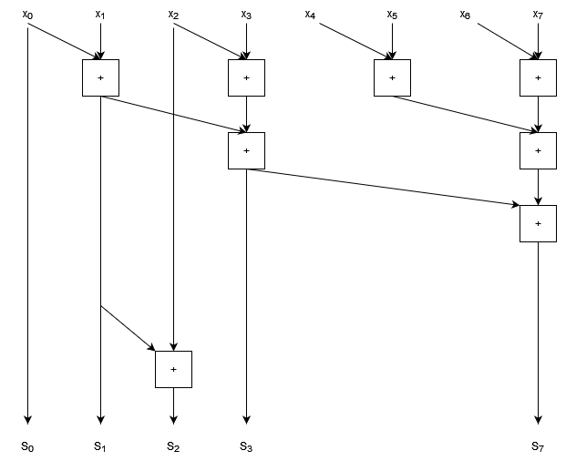

# Work Depth Models

Work depth models are an approach to understanding how parallelisable a computation is in principle, using some of the ideas that we saw earlier when talking about algorithmic complexity. 

With a fixed number of processors, an algorithm may speed up but its complexity won't change, because a fixed number of processors can at best speed up a serial algorithm by a constant factor. 

When looking at the concept of parallelism in general it is often useful to consider what could be done if you had _infinitely many_ processors, and could therefore in principle do arbitrarily many computations in parallel. 

The limitations then reduce to the data dependencies in the algorithm itself: if one computation depends on the result of another, then these have to be done serially. Only independent computations can be done concurrently. 

The point of work-depth models is to understand these data dependencies. We can visualise these dependencies in terms of a **circuit diagram** which maps inputs and outputs of individual computations. Consider the following diagram:


- Each box is a computation, we have given these the labels `a` to `f`. 
- Each arrow represents data flow i.e. input/output. The arrow into `a` represents an initial input. 

In this circuit diagram we can see, for example:
- `b` depends on the output of `a`, so cannot execute until `a` has. 
- `b`, `c`, and `d` can all occur in parallel since none of them depend on the outputs of the others. 
- The total number of computations here is 6. 
- Paths through this graph represent a series of computations that cannot be performed in parallel, e.g. $a \rightarrow b \rightarrow f$, or $a \rightarrow c \rightarrow e \rightarrow f$. 
    - This means we must take at least as much time as it takes to calculate 4 computations in series, since these are in a serial path. 

We can use these ideas to define two important quantities for parallel algorithms:
- **Work** ($W$) is the total number of computations that need to be done.
- **Depth** ($D$) is the length of the longest chain of computations, and represents how much of our algorithm must still happen in serial _even with infinite processors_.  

As we saw when looking at computational complexity, the actual amount of time taken and work done will depend on the time to do each of these computational steps. 

> In the example above, if the computation `b` takes a long time then the computation `c`, `d`, and `e` could all complete and the computation `f` will be waiting for `b` even though the other chains are longer. Usually however we are dealing with chains of computations often representing the same operations (such as arithmetic operations) so the limiting factor becomes the longest chain, but this is not always the case and the circuit diagram just represents the dependencies of each piece of the computation. 

As with our analysis of serial algorithms, it is more useful to use Big-O notation to look at how parallelism _scales_, in which case constant factors become irrelevant. 

Let's look at some concrete examples to understand what we mean. We will look at three related operations on lists: _map_, _reduce_, and _scan_. 

## Map

Map applies a (pure) function to every element of a list:

$\text{map} (f,  [x_0, ..., x_n]) = [f(x_0), ..., f(x_n)]$.

We can see that every element of the output is independent of every other, since each only depends on one element of input. 


- $W \in O(n)$
    - The work is just proportional to the number of elements because we do one computation per element. 
- $D \in O(1)$
    - The depth does not scale with the size of the input because all elements can be processed in parallel. 

Constant depth is a feature of so called "embarassingly parallel" problems, where all computations are independent and you can just throw more computing power at them to speed them up. (With come caveats, but this is an idealised algorithm analysis!)

## Reduce

Reduce is used to calculate things like sums or products of lists. It applies an associative binary operation to the first pair of elements, and then takes the result and applies the binary operation to that result and the next element, and so on until the end of the list until we're left with a single value. For a binary operator $\bigoplus$:

$\text{Reduce}\,(\bigoplus, [x_0, x_1, ..., x_n]) = x_0 \bigoplus x_1 \bigoplus x_2 \bigoplus ... \bigoplus x_n$,

or, in terms of a binary function $f$:  
$\text{Reduce}\,(\bigoplus, [x_0, x_1, ..., x_n]) = f(f(...f(f(x_0, x_1), x_2)...), x_n)$,

- Calculating a reduction with $+$ gives the sum of a list, and with $\times$ gives the product of a list. 

The simplest approach to a serial reduction would look like this:
```cpp
for(const auto &x : v)
{
    total = f(total, x);
}
```
- This has a **loop dependency**, where each iteration of the loop depends on the result of the previous. 
- This is why `parallel for` doesn't work well. Instead we have a `reduce` pragma in openMP. Why is this?

The trick is that our binary operator is **associative**:
- This means we can change the order that we apply the operator.
- We can't change the order of the elements in the list though; that's _commutativity_. 

The loop dependency is a consequence of the way that the code was written, not the problem itself. With an associate operator, we can instead choose to do pairwise operations (e.g. summing a list by pairwise additions), as shown in the diagram below.


- $W \in O(n)$
    - The work is linear in the size of the input list because there is still exactly $n-1$ applications of the operator. 
- $D \in O(\log n)$
    - The depth is $\log n$ because the number of operators to be applied halves at each level of the diagram. 

This kind of tree diagram is a common data dependency pattern, and places some limitations on the speed-up of our algorithm compared to our embarassingly parallel problem. Even with infinite processors, we still can't do better than $O(\log n)$ serial computations! 

We can also see as we move down the tree that we have fewer operations to do in parallel at each stage. Depending on the size of this tree and the number of processors that you have, this means processing power may end up sitting idle which could be reallocated to other tasks elsewhere while this computation is still going on. (This isn't really going to be the case for something as rapid as an addition, but for workflows with similar tree like structures where computations take a long time, you can end up with resources sitting idle for significant amounts of time as you move down the tree.)

> Floating point `+` and `*` is, unlike real $+$ and $\times$, actually non-associative due to the representation issues that we talked about in week 7. We actually have less errors when performing additions pairwise than when performing additions sequentially, because if the inputs are each of similar size then the partials sums will all remain similar size as well. So this pair-wise approach is both better for parallelism **and** better for precision! 


> You may also see `foldl` and `foldr`. These are variations for non-associative operators:  
$\text{foldl} \, (\bigoplus, [x_0, x_1, ..., x_n]) = (...((x_0 \bigoplus x_1) \bigoplus x_2) \bigoplus ... \bigoplus x_n) $  
$\text{foldr} \, (\bigoplus, [x_0, x_1, ..., x_n]) = (x_0 \bigoplus (x_1 \bigoplus (x_2 \bigoplus (... \bigoplus x_n)))...) $  
These data dependencies don't parallelise well because the order of application of the binary operator is fixed! 

## Scan

Scan is similar to reduce, but instead of returning a single scalar result it returns a list containing the cumulative result, for example a cumulative sum or cumulative product. Applying a Scan with $+$ to the list $[1,2,3,4,5]$ for example would give $[1,3,6,10,15]$. 

**Note that we have to be more careful of our order of operations now, since we need to find not just the total, but also the well defined sequence of sums from left to right.**

This is another case where it _looks_ like we have a severe loop dependency which would force us to work in series, but we can in fact parallelise this algorithm as well, _at the cost of repeating some work_. 

- It is not uncommon for parallel algorithms to have to repeat work in order to increase the independence of computations to allow for them to be done in parallel. This is where a more detailed work-depth analysis can be useful, to understand the trade offs that we expect to see. 

To find a parallel solution to this problem, let's start by using the same pairwise operations that we used for the reduction. We'll look at a summation with 8 elements, and rearrange the diagram so that the outputs that are already computed are clearly shown. 


- Inputs are marked $x_0 ... x_7$
- Outputs are marked $S_0 ... S_7$

We can see that the output indices 0, 1, 3, and 7 are computed as part of the pairwise sum process. 

We can see that there are gaps in our cumulative sum that need to be computed. We can also see that the gaps get progressively larger; in fact they double in size each time. (We can see the spacing double clearly by noting that in general indices $2^i - 1$ will be calculated by pairwise sums.)

The trick to this algorithm is to work out how to fill in the gaps. Let's start by filling in index 2, the first gap in our sequence. 



- We need to add one more addition, which reuses our result for $S_1$ and adds $x_2$. 

Now let's try filling in the bigger gap between $S_3$ and $S_7$. We don't want to fill this in sequentially because then we'll just be back in the territory of algorithms and we'll end up with $O(n)$ depth. Instead, we want to construct a similar tree that we had before for the pairwise sum, but now with increasing nodes at each step. 


- Note that when calculating $S_6$ we've re-used the result that we computed for $S_5$. 
- We can also spot a pattern here: there is a tree structure in the lower half of this graph for each gap that gets filled. 
    - At the lowest level, half of the outputs have an additional computation node. 
    - Above that, only half again need an extra node. 
    - This pattern continues up for larger gaps to fill in. 

So to do the parallel scan we find that we have 2 tree structures:
- Each does $O(n)$ work
- Each has depth $O(\log n)$

As a result this algorithm has:
- $W \in O(n)$
- $D \in O(\log n)$

So we can substantially improve the depth (and therefore time) over a serial algorithm with sufficient processing power, but we do approximately _double the total work_ of the serial approach. 

- As a result of the extra work done, having 2 processors tackle this job (using this approach) is unlikely to be very effective: the time you save doing things in parallel would be roughly cancelled out by all the duplicate work you're doing. 
- With four processors we might expect to get a benefit of roughly a factor of 2 on a large list (so most of our time is spent doing paralell computations), because we'll be doing twice as much work with four times the processing power. 


# Approaches to Parallel Algorithms

## Divide and Conquer

We've talked a little about divide and conquer algorithms in the past, for example in our discussion of _merge sort_ in week 7. These algorithms express the solution of a problem in terms of the results from some independent sub-problems. This naturally leads to a parallelised approach with a tree like structure. 

- We can once again use recurrence relations and the Master Theorem from complexity theory to understand the depth of these algorithms. 

## Pipelining 

Pipelining is an approach to task based parallelism where we process a series of data as each piece of data arrives. 
- Data is provided serially
    - This could be from an input stream e.g. series of real-time measurements.
    - Could be produced by some inherently serial computation that can't be paralallelised. 
    - Even when reading from memory we can only read a small amount at a time, so sometimes pipelining can be an effective tactic to overlap the memory read/write overheads with the computation itself. 
- We start processing each piece of data as it arrives.
- We process data in parallel, but pieces of data will be at different stages of the computation. 
    - The "pipeline" refers to the fact that the data is being pushed through a series of computations, with each piece of data following another rather than overlapping. 

The simplest scenario is when the processing of different pieces of data are independent. In order to visualise the benefits of pipelining, it is better to use a different kind of diagram which takes time into account explicitly. 

We'll split time into discrete units (for high performance applications this may be individual CPU clock cycles!); in the diagram below time runs along the horizontal direction with each unit of time being shown in the boxes at the top of the diagram. For this example we'll say that we **receive one piece of data in each unit of time**. 


- The coloured boxes represent computations which can be performed. Boxes that overlap in the vertical direction happen concurrently. 
- `Get` represents retrieving data from our stream. Because data input is sequential these can't overlap with one another, but they _can_ overlap with data processing. 
- Each piece of data read is fed through the series of functions $f$, $g$, $h$. These overlap in time for different data elements but with an offset. 

The time to process a stream of $N$ pieces of data is:

$T = t_0 + (N-1) \times I $  
where:
- $t_0$ is the time to process one piece of pieces of data. In our example, this is the time for `Get`, $f$, $g$, and $h$, which we can see from the diagram is 9 of our time units.
- $I$ is the "initiation interval", which is the time delay between starting to process one piece of data and beginning on the next. In this example it is 1, which is the ideal, although there are times when data dependencies can force this to be larger than 1.

We can see how to arrive at this formula because due to the overlap of our computations, after finishing processing the first piece of data ($t_0$), we only need to take another $I$ units of time for each additional piece of data ($N-1$ in total). 

- Pipelines can be implemented using threads on multi-core CPUs.
- Pipelines are a key form of data parallelism for devices such as ASICs and FPGAs. 
- They are an extremely efficient way of moving from serial processes into parallel computations. 

### Comparison with Batching 

Another approach to processing data in parallel is to load as much data as you can parallelise over, and then process this data all at the same time instead of using the staggered approach of pipelining. You'd then end up with a workflow that looks like the one below:


This is the kind of approach that is used for devices such as GPUs. 

If you have enough parallel channels to process _all_ of your elements in parallel, then this gives the same total execution time as the perfect pipelining solution: just the time to load all data plus the time to process one element. 

The difference between these approaches comes when you have more data than you have parallel channels.

- Perfect pipelining only requires as many parallel channels as there can be data elements overlapping. If we look at our pipelining diagram above, our processing ($f$, $g$, and $h$) takes 9 units of time, and we get a new element every time unit, so we can only 9 data processes will overlap before the first channel is free to receive data again. This means _no matter how many data elements are in our stream_ we can achieve our best pipelining performance with just 9 parallel channels in this example. 
    - This makes pipelines extremely powerful for optimising parallel performance with minimal resources, especially when dealing with very long or potentially indefinite streams. 
- When batching, if there are not enough channel to process everything in one parallel batch, then we need to run multiple processing steps, which will add time. If we have $P$ parallel channels and $N$ data elements, we will have to take at least $\frac{N}{P} t_0$ steps to process our data.
    - Depending on the device you use you may be able to keep the time down by reading the next batch of data while processing the current one.

**One should note however that devices such as GPUs manage to be very fast by having both a very large number of parallel channels and very fast hardware. These kinds of considerations can be more important than pure parallelism which only analyses what can be done at the same time: always consider the time things would take in the real world!**